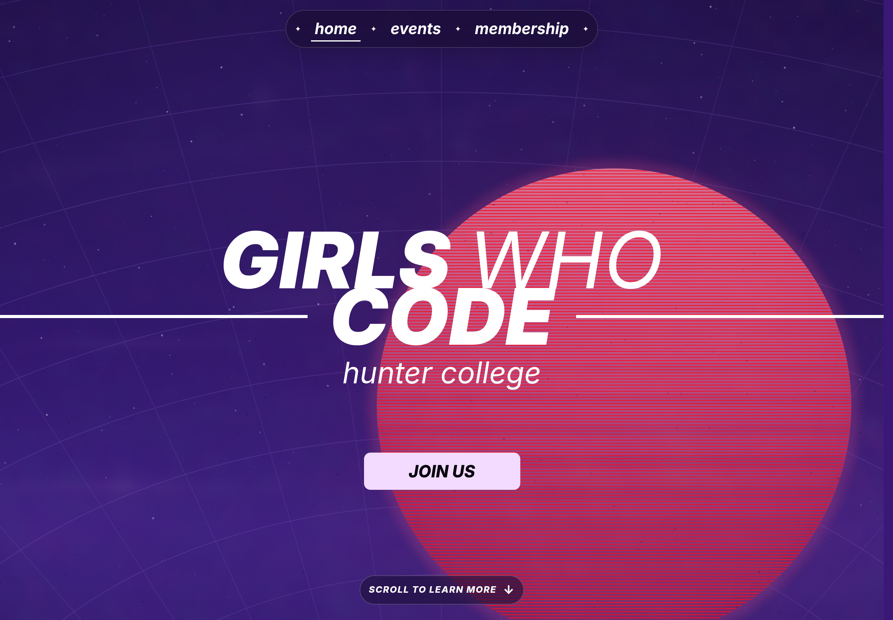
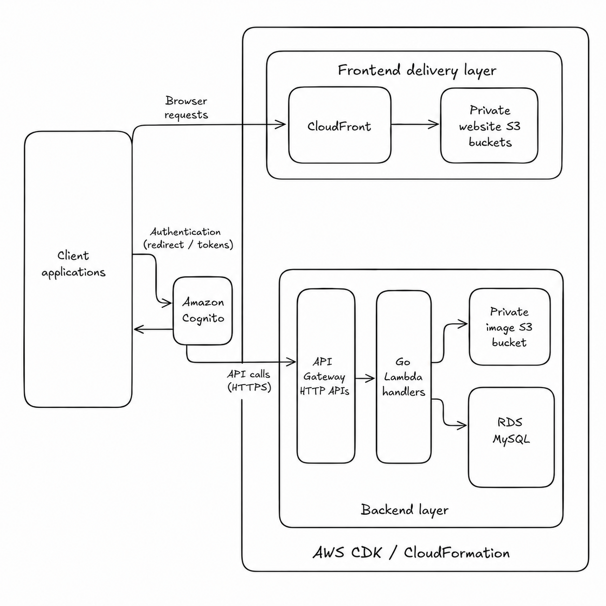

# Girls Who Code Hunter Website & Event Management System

Website hosting and event-management services for Girls Who Code at Hunter College and the broader Hunter club community. Frontend application source is maintained separately.

## System Overview

- **Frontend delivery:** hosts and distributes the Girls Who Code Hunter website and event-management frontend.
- **Event-management backend:** provides authentication, API access, and storage for clubs, events, memberships, and related application data.

## Website Hosting

Amazon S3 and CloudFront distribute the frontends, with optional custom-domain support through Route 53 and ACM. The Girls Who Code Hunter website is one of the frontends hosted through this system.

- [Visit the Girls Who Code Hunter website](https://girlswhocodehunter.org)
- [View the hosting and deployment architecture](hosting/README.md)

## Event Management Backend

The backend supports authentication, club and event data, and image storage using Cognito, API Gateway, Go Lambda handlers, S3, and RDS MySQL.

[Explore the backend documentation](infrastructure/legacy/README.md)

## Modular Backend Architecture

The backend is being separated so API and database logic are independent of AWS infrastructure code. The integrated implementation is retained during migration.

| Directory | Responsibility |
| --- | --- |
| `database/` | Database and domain persistence concerns |
| `api/` | API and application logic |
| `infrastructure/` | Backend AWS deployment infrastructure |
| `infrastructure/legacy/` | Previous integrated implementation retained during migration |

## License

See [LICENSE](LICENSE).
