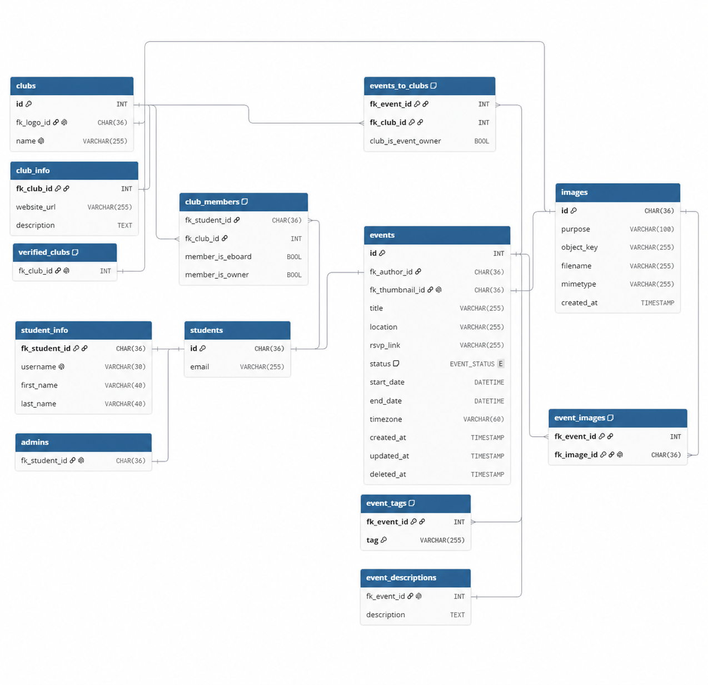

# Database migration map

This directory is the future boundary for the provider-independent application database module. It currently contains documentation and the reused schema image only; no schema, migration runner, query, or database client has been moved from [`infrastructure/legacy/`](../infrastructure/legacy/).

## Boundary and portability principle

**MySQL is the application database technology. Amazon RDS is only the current hosting environment.** The same schema and query behavior should eventually be usable with:

- Amazon RDS for MySQL;
- MySQL on Amazon EC2;
- another compatible MySQL host; and
- local MySQL.

Provider independence here means independence from AWS hosting, credentials, networking, and deployment APIs. It does not mean converting the current MySQL schema or SQL dialect to a different database engine during this migration.

The future module should own MySQL schema history, migrations, query behavior, transactions, and database-facing models. AWS Secrets Manager lookup, RDS endpoints, VPC attachment, Lambda configuration, and IAM permissions belong behind adapters in the API/infrastructure boundary.

## Evidence and interpretation rules

The current legacy code is authoritative for status. This inventory was checked against:

- the initializer's selected DDL and seed migrations;
- all 21 embedded application SQL files under [`utils/query_client/queries/`](../infrastructure/legacy/utils/query_client/queries/);
- every current handler query call;
- query-client connection, loading, and transaction code;
- inactive endpoint stub SQL; and
- schema-implied operations required by the historical endpoint plan.

The historical `GWC Website Documentation.pdf` supplied entity and endpoint intent only. Its older conceptual schema, July-era SQL assumptions, and project-management checkmarks do not override the current November DDL or current callers.

## Query migration status legend

- ✅ **Legacy query exists and can be ported** — SQL and its callers are identifiable, even when the caller has a separately documented API/auth concern.
- 🟨 **Partial** — query behavior is broken, missing one required part, spread across stale/inactive sources, or only reusable primitives exist.
- ⬜ **Query required but not found** — the current schema or planned endpoint needs the behavior, but no implementation was found.
- ❓ **Manual review** — product/data semantics must be decided before the query group can be defined.

## Migration summary

This checklist contains **29 meaningful query groups**:

| Status | Count |
| --- | ---: |
| ✅ Legacy query exists and can be ported | 14 |
| 🟨 Partial or spread across sources | 7 |
| ⬜ Query still required | 7 |
| ❓ Manual review | 1 |
| **Total** | **29** |

The current query surface accounts for 16 responsibilities: 14 ✅ groups and 2 🟨 groups. The 21 embedded SQL files form 15 of those groups; the sixteenth is the active event-image read whose required SQL file is absent. The other 13 groups capture historical/stubbed needs, schema gaps, and one unresolved ownership decision.

No query-specific unit or integration tests were found. Migration readiness therefore means “identifiable for porting,” not “runtime behavior has been proven.”

## Planned database directory structure

The following tree is **planned documentation only**. No empty implementation directories should be created until their first migrated behavior is ready.

```text
database/
├── migrations/
│   ├── schema/
│   └── seed/
├── queries/
│   ├── students/
│   │   └── ensure/
│   ├── me/
│   │   ├── get/
│   │   ├── clubs/
│   │   │   ├── list/
│   │   │   └── eboard/
│   │   │       └── list/
│   │   └── events/
│   │       └── list/
│   ├── clubs/
│   │   ├── list/
│   │   ├── get/
│   │   ├── create/
│   │   ├── members/
│   │   │   ├── list/
│   │   │   ├── create/
│   │   │   ├── leave/
│   │   │   └── update_role/
│   │   ├── events/
│   │   │   └── list/
│   │   ├── verification/
│   │   │   ├── create/
│   │   │   └── delete/
│   │   └── thumbnails/
│   │       └── confirm/
│   ├── events/
│   │   ├── read/
│   │   ├── create/
│   │   ├── update/
│   │   ├── delete/
│   │   ├── images/
│   │   │   ├── list/
│   │   │   └── confirm/
│   │   └── thumbnails/
│   │       └── confirm/
│   ├── authorization/
│   │   ├── clubs/
│   │   │   └── can_manage/
│   │   └── events/
│   │       └── can_manage/
│   ├── admins/
│   │   ├── list/
│   │   ├── get/
│   │   ├── create/
│   │   ├── delete/
│   │   └── is_admin/
│   └── images/
│       └── delete/
└── client/
```

Route-shaped query paths should help developers find behavior, not force duplication. The public and authorized event routes should share event-read queries and compose them with visibility/authorization policies. See the [planned API tree](../api/README.md#planned-api-directory-structure).

## Current authoritative schema

The initializer explicitly selects [`11_04_2025_create_core_tables_up.sql`](../infrastructure/legacy/lambda/internal/database/init/migrations/11_04_2025_create_core_tables_up.sql) as the current core DDL. If this image or older documentation differs from that file, the SQL file wins.



See the [detailed legacy database overview](../infrastructure/legacy/docs/database/README.md) and [table-by-table schema reference](../infrastructure/legacy/docs/database/schema.md).

### Current tables

| Table | Current purpose | Query coverage |
| --- | --- | --- |
| `students` | Cognito `sub` identity and optional email | Ensure/upsert and current-student reads exist. |
| `student_info` | Optional username/name profile | No current application query. |
| `clubs` | Club identity, name, and logo image FK | Read/create queries exist; logo assignment does not. |
| `club_info` | Website URL and description | Read/create queries exist. |
| `club_members` | Student/club membership with e-board/owner flags | Self-join/leave/read/auth queries exist; lists and role updates do not. |
| `verified_clubs` | Public-discovery approval relation | Read filter exists; writes do not. |
| `admins` | Global administrator relation | Only stale hard-coded stub SQL exists. |
| `events` | Author, thumbnail, details, status, dates, and lifecycle timestamps | Reads exist; create SQL is broken; update/delete do not exist. |
| `event_descriptions` | One description per event | Read exists; create SQL is broken. |
| `event_tags` | Event tags | No current application query. |
| `images` | Storage metadata | Event-image insert exists; delete and thumbnail assignment do not. |
| `events_to_clubs` | Many-to-many event/club relation and owner-club flag | Read, create-link, and event-authorization queries exist. |
| `event_images` | Event/gallery-image relation | Insert exists; active read query is missing. |

### Initialization sources

The current initializer at [`lambda/internal/database/init/main.go`](../infrastructure/legacy/lambda/internal/database/init/main.go):

1. runs [`07_11_2025_create_databases_up.sql`](../infrastructure/legacy/lambda/internal/database/init/migrations/07_11_2025_create_databases_up.sql) to create `STAGING` and `PRODUCTION`;
2. applies the November core DDL to both databases; and
3. applies [`09_14_2025_seed_tables.sql`](../infrastructure/legacy/lambda/internal/database/init/migrations/09_14_2025_seed_tables.sql) to `STAGING`.

The runner splits files on semicolons and executes statements without a migration-history table or encompassing transaction. Foreign-key ALTER statements and seed inserts can leave a partially initialized database, and the seed is not safely repeatable. There is no down migration matching the current November DDL. These are migration-runner concerns, not reasons to redesign the schema in this documentation phase.

## Shared application query access

Current access is implemented by [`query_client.go`](../infrastructure/legacy/utils/query_client/query_client.go), [`helpers.go`](../infrastructure/legacy/utils/query_client/helpers.go), and [`types.go`](../infrastructure/legacy/utils/query_client/types.go):

- Go embeds every `queries/**/*.sql` file into each consuming binary.
- `sqlx` and the MySQL driver execute `Get`, `Select`, `Exec`, and transaction helpers.
- active handlers use `NewClientFromHost`, which loads credentials from AWS Secrets Manager and receives an RDS host/schema through environment variables.
- `loadSQLFromFile` allocates exactly 4096 bytes and ignores the byte count returned by `Read`, so every query risks trailing null bytes and queries over 4 KiB risk truncation.
- `Get`, `Select`, and `Exec` do not use context-aware database methods.
- `NewClient` accepts but does not apply `dbName`; active code uses `NewClientFromHost` instead.
- the unused `ChangeDatabase` helper concatenates `USE ` with a caller-supplied database name; do not port that unvalidated identifier construction.

The future `database/client/` should accept provider-neutral MySQL connection configuration and propagate request contexts. AWS secret retrieval and RDS endpoint resolution should be injected by an adapter outside this core module.

Current SQL intentionally uses MySQL features such as `AUTO_INCREMENT`, `ENUM`, `BOOL`, backticks, `ON DUPLICATE KEY UPDATE`, and MySQL nullable/unique semantics. Preserve those semantics unless a separate database redesign is approved.

The DDL also permits null in many non-primary-key columns while several current Go club/event model fields use non-pointer values. Query migration needs scan-parity fixtures beyond the specifically known nullable-student-email case.

## Query migration inventory

### 1. Student existence and upsert

**Status:** ✅ Legacy queries exist and can be ported.

**Purpose:** Ensures a Cognito `sub` has a `students` row, optionally updates email, and supports both identity-trigger and request-time synchronization.

**Used by:** Internal Cognito student sync and these handler paths: [`GET /me`](../infrastructure/legacy/lambda/api/me/get.go), [`GET /me/clubs`](../infrastructure/legacy/lambda/api/me/clubs/get.go), [`GET /me/events`](../infrastructure/legacy/lambda/api/me/events/get.go), [`POST /clubs`](../infrastructure/legacy/lambda/api/clubs/post/post.go), [`POST /clubs/{clubId}/events`](../infrastructure/legacy/lambda/api/clubs/clubId/events/post/post.go), [`POST /clubs/{clubId}/members/me`](../infrastructure/legacy/lambda/api/clubs/clubId/members/me/post/post.go), and the currently miswired [`DELETE /clubs/{clubId}/members/me`](../infrastructure/legacy/lambda/api/clubs/clubId/members/me/delete/delete.go). Their route context is documented under [Internal student registration](../api/README.md#internal-student-registration), [Me](../api/README.md#me), and [Clubs](../api/README.md#clubs).

**Tables:** `students`.

**Legacy queries:** [`EXISTS_student_by_sub.sql`](../infrastructure/legacy/utils/query_client/queries/students/EXISTS_student_by_sub.sql), [`UPSERT_student.sql`](../infrastructure/legacy/utils/query_client/queries/students/UPSERT_student.sql), and [`UPSERT_student_sub_only.sql`](../infrastructure/legacy/utils/query_client/queries/students/UPSERT_student_sub_only.sql).

**Legacy callers:** [`utils/auth/ensure_student.go`](../infrastructure/legacy/utils/auth/ensure_student.go) and [`lambda/internal/auth/postConfirm/upsert.go`](../infrastructure/legacy/lambda/internal/auth/postConfirm/upsert.go).

**Proposed future path:** `database/queries/students/ensure/` (**planned**).

**Portable:** Yes. Preserve MySQL `ON DUPLICATE KEY UPDATE`; inject connection credentials rather than loading AWS Secrets Manager in the query module.

**Migration notes:** The existence check and upsert are separate request-time operations, but the upsert remains safe under a race. Decide whether request-time synchronization should update a changed email when the row already exists; current `RequireStudent` does not.

### 2. Current student

**Status:** ✅ Legacy query exists and can be ported.

**Purpose:** Reads the student matching the verified caller identity.

**Used by:** [`GET /me`](../api/README.md#me).

**Tables:** `students`.

**Legacy query:** [`SELECT_student_by_sub.sql`](../infrastructure/legacy/utils/query_client/queries/students/SELECT_student_by_sub.sql).

**Legacy caller:** [`lambda/api/me/get.go`](../infrastructure/legacy/lambda/api/me/get.go).

**Proposed future path:** `database/queries/me/get/` (**planned**).

**Portable:** Yes.

**Migration notes:** `students.email` is nullable, but the current Go model uses a non-nullable string. Add a parity test and choose an explicit null representation before moving the model.

### 3. Current student's clubs and roles

**Status:** ✅ Legacy query exists and can be ported.

**Purpose:** Lists the caller's club memberships, logo object key, and a computed role with owner precedence over e-board and member.

**Used by:** [`GET /me/clubs`](../api/README.md#me).

**Tables:** `club_members`, `clubs`, `images`.

**Legacy query:** [`SELECT_student_clubs.sql`](../infrastructure/legacy/utils/query_client/queries/students/SELECT_student_clubs.sql).

**Legacy caller:** [`lambda/api/me/clubs/get.go`](../infrastructure/legacy/lambda/api/me/clubs/get.go).

**Proposed future path:** `database/queries/me/clubs/list/` (**planned**).

**Portable:** Yes.

**Migration notes:** The selected `images.object_key` is exposed by the current API as `thumbnailUrl`. Keep storage URL generation outside the query, and decide at the API layer whether to preserve that naming quirk.

### 4. Current student's events

**Status:** ✅ Legacy query exists and can be ported.

**Purpose:** Reads posted events associated with any club joined by the caller, including description and linked-club rows.

**Used by:** Active [`GET /me/events`](../api/README.md#me), which replaced historical `GET /me/clubs/events`.

**Tables:** `events`, `events_to_clubs`, `clubs`, `images`, `event_descriptions`, `club_members`.

**Legacy query:** [`SELECT_student_events.sql`](../infrastructure/legacy/utils/query_client/queries/students/SELECT_student_events.sql).

**Legacy caller:** [`lambda/api/me/events/get.go`](../infrastructure/legacy/lambda/api/me/events/get.go).

**Proposed future path:** `database/queries/me/events/list/` (**planned**).

**Portable:** Yes.

**Migration notes:** SQL applies strict date bounds and paginates joined association rows, not distinct events. It returns only linked clubs the student joined, which can omit the owner club from an otherwise qualifying event. Preserve this only through explicit contract tests.

### 5. Club list and verified filter

**Status:** ✅ Legacy query exists and can be ported.

**Purpose:** Lists club summaries and optionally restricts them to rows present in `verified_clubs`.

**Used by:** [`GET /clubs`](../api/README.md#clubs), including `?verified=true`.

**Tables:** `clubs`, `images`, `verified_clubs`.

**Legacy query:** [`SELECT_clubs.sql`](../infrastructure/legacy/utils/query_client/queries/clubs/SELECT_clubs.sql).

**Legacy caller:** [`lambda/api/clubs/get.go`](../infrastructure/legacy/lambda/api/clubs/get.go).

**Proposed future path:** `database/queries/clubs/list/` (**planned**).

**Portable:** Yes.

**Migration notes:** The boolean argument implements “all versus verified-only” in one query. The route accepts only exact `true`/`TRUE`; query code should not absorb HTTP string parsing.

### 6. Club detail

**Status:** ✅ Legacy query exists and can be ported.

**Purpose:** Reads one club with optional image object key and club information.

**Used by:** [`GET /clubs/{clubId}`](../api/README.md#clubs).

**Tables:** `clubs`, `images`, `club_info`.

**Legacy query:** [`SELECT_club.sql`](../infrastructure/legacy/utils/query_client/queries/clubs/SELECT_club.sql).

**Legacy caller:** [`lambda/api/clubs/clubId/get.go`](../infrastructure/legacy/lambda/api/clubs/clubId/get.go).

**Proposed future path:** `database/queries/clubs/get/` (**planned**).

**Portable:** Yes.

**Migration notes:** Keep HTTP path validation and not-found response mapping outside the query. Optional `club_info` and logo rows must remain nullable in the data model.

### 7. Club creation

**Status:** ✅ Legacy queries exist and can be ported.

**Purpose:** Inserts the main club row, obtains its auto-increment ID, and inserts the matching `club_info` row atomically.

**Used by:** [`POST /clubs`](../api/README.md#clubs).

**Tables:** `clubs`, `club_info`.

**Legacy queries:** [`INSERT_club.sql`](../infrastructure/legacy/utils/query_client/queries/clubs/INSERT_club.sql) and [`INSERT_club_info.sql`](../infrastructure/legacy/utils/query_client/queries/clubs/INSERT_club_info.sql).

**Legacy caller/transaction:** [`lambda/api/clubs/post/post.go`](../infrastructure/legacy/lambda/api/clubs/post/post.go) through [`QueryClient.ExecInsertQuery`](../infrastructure/legacy/utils/query_client/query_client.go).

**Proposed future path:** `database/queries/clubs/create/` (**planned**).

**Portable:** Yes; retain a MySQL transaction and last-insert-ID behavior behind a database interface.

**Migration notes:** This transaction does **not** create an owner membership or verification row. That unresolved behavior is tracked as [group 29](#29-club-creator-ownership).

### 8. Join caller to club

**Status:** ✅ Legacy query exists and can be ported.

**Purpose:** Inserts a regular membership only when both student and club exist and the membership does not already exist.

**Used by:** Active self-service [`POST /clubs/{clubId}/members/me`](../api/README.md#clubs); it partially satisfies historical `POST /clubs/{clubId}/members`.

**Tables:** `students`, `clubs`, `club_members`.

**Legacy query:** [`INSERT_club_member.sql`](../infrastructure/legacy/utils/query_client/queries/clubs/INSERT_club_member.sql).

**Legacy caller:** [`lambda/api/clubs/clubId/members/me/post/post.go`](../infrastructure/legacy/lambda/api/clubs/clubId/members/me/post/post.go).

**Proposed future path:** Shared `database/queries/clubs/members/create/`, with caller-scoping enforced by the API service (**planned**).

**Portable:** Yes.

**Migration notes:** The query accepts a student ID parameter and can be reused for an authorized “add specified member” operation, but the current handler supplies only the verified caller and always assigns both role flags false. It does not require a verified club.

### 9. Leave caller's club

**Status:** ✅ Legacy query exists and can be ported.

**Purpose:** Deletes a membership only when it belongs to the caller/club pair and is not marked owner.

**Used by:** [`DELETE /clubs/{clubId}/members/me`](../api/README.md#clubs).

**Tables:** `club_members`.

**Legacy query:** [`DELETE_club_member.sql`](../infrastructure/legacy/utils/query_client/queries/clubs/DELETE_club_member.sql).

**Legacy caller:** [`lambda/api/clubs/clubId/members/me/delete/delete.go`](../infrastructure/legacy/lambda/api/clubs/clubId/members/me/delete/delete.go).

**Proposed future path:** `database/queries/clubs/members/leave/` (**planned**).

**Portable:** Yes.

**Migration notes:** The SQL owner guard is valid behavior, but the active route never supplies the JWT context its handler requires. That is an API wiring defect, not a missing query. Also review nullable `member_is_owner`: `= FALSE` does not match null.

### 10. Club event list

**Status:** ✅ Legacy query exists and can be ported.

**Purpose:** Reads status/date-filtered events linked to one club, with descriptions and club-logo object keys.

**Used by:** Public [`GET /clubs/{clubId}/events`](../api/README.md#clubs); its status parameter can also support a future authorized draft list.

**Tables:** `events`, `events_to_clubs`, `clubs`, `images`, `event_descriptions`.

**Legacy query:** [`SELECT_club_events.sql`](../infrastructure/legacy/utils/query_client/queries/clubs/SELECT_club_events.sql).

**Legacy caller:** [`lambda/api/clubs/clubId/events/get.go`](../infrastructure/legacy/lambda/api/clubs/clubId/events/get.go).

**Proposed future path:** `database/queries/clubs/events/list/` (**planned**).

**Portable:** Yes.

**Migration notes:** The current handler supplies `posted`, `%`, strict date bounds, limit, and offset. SQL paginates joined rows, and filtering to the requested club prevents the response from reconstructing all event associations.

### 11. Public and composite event read

**Status:** ✅ Legacy query exists and can be ported.

**Purpose:** Reads posted event rows, descriptions, and owner/associate club relations for both list and single-event responses.

**Used by:** [`GET /events`](../api/README.md#events), [`GET /events/{eventId}`](../api/README.md#events), and the historical description/club subresources now combined into event detail.

**Tables:** `events`, `events_to_clubs`, `clubs`, `images`, `event_descriptions`.

**Legacy query:** [`SELECT_events.sql`](../infrastructure/legacy/utils/query_client/queries/events/SELECT_events.sql).

**Legacy callers:** [`lambda/api/events/get.go`](../infrastructure/legacy/lambda/api/events/get.go) and [`lambda/api/events/eventId/get.go`](../infrastructure/legacy/lambda/api/events/eventId/get.go).

**Proposed future path:** Shared `database/queries/events/read/`, with list/get wrappers rather than duplicated SQL (**planned**).

**Portable:** Yes.

**Migration notes:** The query uses `LIKE` for an integer event ID, strict date bounds, row-level pagination, and no `deleted_at` predicate. The detail handler caps joined rows at 100. Historical stub event/description SQL is superseded by this composite query and should not be migrated independently.

### 12. Create event draft

**Status:** 🟨 Query group exists but is deterministically broken and split across transaction boundaries.

**Purpose:** Inserts a drafted event, its owner/associate club links, and description.

**Used by:** [`POST /clubs/{clubId}/events`](../api/README.md#clubs).

**Tables:** `events`, `events_to_clubs`, `event_descriptions`; foreign keys also depend on `students` and `clubs`.

**Legacy queries:** [`INSERT_event.sql`](../infrastructure/legacy/utils/query_client/queries/events/INSERT_event.sql), [`INSERT_event_club_link.sql`](../infrastructure/legacy/utils/query_client/queries/events/INSERT_event_club_link.sql), and [`INSERT_event_description.sql`](../infrastructure/legacy/utils/query_client/queries/events/INSERT_event_description.sql).

**Legacy caller:** [`lambda/api/clubs/clubId/events/post/post.go`](../infrastructure/legacy/lambda/api/clubs/clubId/events/post/post.go).

**Proposed future path:** `database/queries/events/create/` as one transaction (**planned**).

**Portable:** Partial.

**Migration notes:** `INSERT_event.sql` names 11 columns but supplies 10 values and has no value expression for `rsvp_link` while the handler passes seven arguments. `INSERT_event_description.sql` has a trailing comma in its column list. The initial event insert uses `Exec` before link/description `ExecMulti`, so a later failure can orphan the draft. Repair and test this behavior; do not copy it unchanged.

### 13. Club authorization

**Status:** ✅ Legacy query/helper exists and can be ported, but no active handler calls it.

**Purpose:** Returns whether a student is an e-board member or owner of a specified club.

**Used by:** Intended dependency for protected club/event writes and member administration documented under [Clubs](../api/README.md#clubs).

**Tables:** `club_members`.

**Legacy query:** [`IS_student_authorized_club.sql`](../infrastructure/legacy/utils/query_client/queries/authorization/IS_student_authorized_club.sql).

**Legacy callers/helpers:** [`utils/auth/club_authorization.go`](../infrastructure/legacy/utils/auth/club_authorization.go) and a duplicate [`lambda/internal` package](../infrastructure/legacy/lambda/internal/auth/club_authorization/club_authorization.go); neither is called by active handlers.

**Proposed future path:** `database/queries/authorization/clubs/can_manage/` (**planned**).

**Portable:** Yes.

**Migration notes:** Port one implementation and expose it through a shared application authorization policy. Owner-only operations such as historical role promotion require a stricter query/policy than this e-board-or-owner check.

### 14. Event authorization

**Status:** ✅ Legacy query/helper exists and can be ported, but no active handler calls it.

**Purpose:** Returns whether a student is an e-board member or owner of any club linked to an event.

**Used by:** Intended dependency for historical [authorized event routes](../api/README.md#authorized-events).

**Tables:** `events_to_clubs`, `club_members`.

**Legacy query:** [`IS_student_authorized_event.sql`](../infrastructure/legacy/utils/query_client/queries/authorization/IS_student_authorized_event.sql).

**Legacy callers/helpers:** [`utils/auth/event_authorization.go`](../infrastructure/legacy/utils/auth/event_authorization.go) and duplicate [`lambda/internal` package](../infrastructure/legacy/lambda/internal/auth/event_authorization/event_authorization.go); neither is called by active handlers.

**Proposed future path:** `database/queries/authorization/events/can_manage/` (**planned**).

**Portable:** Yes.

**Migration notes:** The “any associated club” rule matches the historical rationale for `/auth/events/{eventId}`. Confirm whether owner-club authority, event authorship, or admins should have different precedence before migration.

### 15. Event-image metadata confirmation

**Status:** ✅ Legacy insert queries exist and can be ported.

**Purpose:** Inserts image metadata and links the new image to an event after a direct storage upload.

**Used by:** [`POST /clubs/{clubId}/events/{eventId}/images/confirm`](../api/README.md#images); the generic historical internal image write can reuse the metadata insert.

**Tables:** `images`, `event_images`; the event foreign key also depends on `events`.

**Legacy queries:** [`INSERT_image.sql`](../infrastructure/legacy/utils/query_client/queries/images/INSERT_image.sql) and [`INSERT_event_image.sql`](../infrastructure/legacy/utils/query_client/queries/images/INSERT_event_image.sql).

**Legacy caller:** [`lambda/api/clubs/events/images/confirm/post.go`](../infrastructure/legacy/lambda/api/clubs/events/images/confirm/post.go).

**Proposed future path:** `database/queries/events/images/confirm/`, reusing a shared image-metadata insert primitive (**planned**).

**Portable:** Yes.

**Migration notes:** The current handler performs two independent `Exec` calls, so a failed association leaves an orphan `images` row. It trusts client-provided identifiers/keys and does not check object existence. Move both database writes into one transaction; keep storage verification in the application/storage adapter. The handler also closes a package-level client after each request, which can break warm Lambda reuse.

### 16. Event-image list

**Status:** 🟨 Active handler exists, but its required query file is absent.

**Purpose:** Reads image metadata for an event so the API/storage adapter can produce download URLs.

**Used by:** Active but broken club-scoped gallery read and historical public/protected image reads under [Images](../api/README.md#images) and [Authorized events](../api/README.md#authorized-events).

**Tables:** Expected `event_images` joined to `images`.

**Legacy query:** **Missing:** `utils/query_client/queries/images/SELECT_event_images.sql`.

**Legacy caller:** [`lambda/api/clubs/events/images/get/get.go`](../infrastructure/legacy/lambda/api/clubs/events/images/get/get.go).

**Proposed future path:** Shared `database/queries/events/images/list/` (**planned**).

**Portable:** Partial.

**Migration notes:** Define and test the selected fields against the handler's nested `sqlx` scan shape. The handler also closes its package-level database connection after every request, risking failure on warm Lambda reuse. Posted-versus-draft visibility and URL signing are API/policy/storage concerns, not reasons to duplicate the metadata query.

### 17. My e-board clubs

**Status:** 🟨 Inactive handler and stale stub SQL only; active role-list behavior can be reused.

**Purpose:** Lists clubs where the caller is an e-board member or owner.

**Used by:** Historical [`GET /me/clubs/eboard`](../api/README.md#me).

**Tables:** `club_members`, `clubs`, and optionally `images`.

**Legacy query:** [`stub/lambda/me/clubs/eboard/eboard.sql`](../infrastructure/legacy/stub/lambda/me/clubs/eboard/eboard.sql).

**Legacy caller:** Hard-coded inactive [`stub/lambda/me/clubs/eboard/get.go`](../infrastructure/legacy/stub/lambda/me/clubs/eboard/get.go).

**Proposed future path:** `database/queries/me/clubs/eboard/list/`, or reuse group 3 with a role filter (**planned**).

**Portable:** Partial.

**Migration notes:** The stub SQL selects student IDs rather than clubs and lacks parentheses around its `AND`/`OR` role condition. Prefer filtering/reusing the current club-and-role query over porting this SQL.

### 18. Club member and e-board listing

**Status:** ⬜ Query required but not found.

**Purpose:** Lists club memberships, optionally filtered to e-board/owner roles, for historical member administration routes.

**Used by:** Historical `GET /clubs/{clubId}/members` and `GET /clubs/{clubId}/eboard` under [Clubs](../api/README.md#clubs).

**Tables:** Expected `club_members`, `students`, and possibly `student_info`.

**Legacy query/caller:** None; only placeholder `.txt` files exist under [`stub/lambda/clubs/clubId/members/`](../infrastructure/legacy/stub/lambda/clubs/clubId/members/).

**Proposed future path:** Shared `database/queries/clubs/members/list/` with an explicit role filter (**planned**).

**Portable:** N/A until implemented.

**Migration notes:** Define visibility, profile fields, pagination, and ordering before implementation. Do not create separate duplicated SQL for members and e-board if one filtered query suffices.

### 19. Add a specified club member

**Status:** 🟨 The insert primitive exists, but no authorized endpoint adds a student other than the caller.

**Purpose:** Adds a chosen student to a club, distinct from self-service join.

**Used by:** Historical `POST /clubs/{clubId}/members`; the active route is caller-only `.../members/me`.

**Tables:** `students`, `clubs`, `club_members`.

**Legacy query:** Reusable [`INSERT_club_member.sql`](../infrastructure/legacy/utils/query_client/queries/clubs/INSERT_club_member.sql).

**Legacy caller:** Only the self-join handler [`lambda/api/clubs/clubId/members/me/post/post.go`](../infrastructure/legacy/lambda/api/clubs/clubId/members/me/post/post.go).

**Proposed future path:** Shared `database/queries/clubs/members/create/` with API-level caller/target authorization (**planned**).

**Portable:** Partial; SQL is portable, endpoint/policy behavior is missing.

**Migration notes:** Define who can add another student, how the target is identified, and whether initial roles can be supplied. Do not let a route body bypass caller/owner policy.

### 20. Update member roles

**Status:** ⬜ Query required but not found.

**Purpose:** Promotes/demotes a club member's e-board/owner flags.

**Used by:** Historical `PUT /clubs/{clubId}/members/roles` under [Clubs](../api/README.md#clubs).

**Tables:** `club_members`.

**Legacy query/caller:** No embedded application `UPDATE club_members` query or active handler found. A local [`stub/environment/populate.sql`](../infrastructure/legacy/stub/environment/populate/populate.sql) fixture contains hard-coded UPDATE statements but is not endpoint behavior.

**Proposed future path:** `database/queries/clubs/members/update_role/` (**planned**).

**Portable:** N/A until implemented.

**Migration notes:** The historical owner-only rule is stricter than the current club authorization query. Define invariants for one/multiple owners, self-promotion, self-demotion, and nullable role values.

### 21. Club draft events

**Status:** 🟨 Reusable status-parameterized SQL exists, but no draft route/handler composes it with authorization.

**Purpose:** Lists drafted events linked to a club for authorized managers.

**Used by:** Historical `GET /clubs/{clubId}/events/drafts` under [Clubs](../api/README.md#clubs).

**Tables:** Same as [group 10](#10-club-event-list): `events`, `events_to_clubs`, `clubs`, `images`, `event_descriptions`.

**Legacy query:** Reusable [`SELECT_club_events.sql`](../infrastructure/legacy/utils/query_client/queries/clubs/SELECT_club_events.sql); active caller hardcodes `posted`.

**Legacy caller:** [`lambda/api/clubs/clubId/events/get.go`](../infrastructure/legacy/lambda/api/clubs/clubId/events/get.go) for public posted reads only.

**Proposed future path:** Reuse `database/queries/clubs/events/list/`; pass an application-approved status after club authorization (**planned**).

**Portable:** Partial.

**Migration notes:** Do not expose the query's status argument directly to an unauthenticated caller.

### 22. Admin CRUD

**Status:** 🟨 Schema plus hard-coded GET/DELETE stub SQL only.

**Purpose:** Lists, reads, creates, and removes global administrator records.

**Used by:** Historical [Admin routes](../api/README.md#admins).

**Tables:** `admins`, with `students` needed for validated identities and richer responses.

**Legacy queries:** Unwired [`GET_admins_studentId.sql`](../infrastructure/legacy/stub/lambda/admins/studentId/GET_admins_studentId.sql) and [`DELETE_admins_studentId.sql`](../infrastructure/legacy/stub/lambda/admins/studentId/DELETE_admins_studentId.sql).

**Legacy caller:** None. No list/create SQL or active handler exists.

**Proposed future path:** `database/queries/admins/{list,get,create,delete}/` plus a reusable admin check (**planned**).

**Portable:** Partial.

**Migration notes:** Both stubs hardcode integer ID `2`, while the current schema uses Cognito `CHAR(36)` student IDs. Treat the stubs as intent only. Admin bootstrap and last-admin rules belong in application policy/transactions.

### 23. Club verification writes

**Status:** ⬜ Queries required but not found.

**Purpose:** Adds/removes a club from public verification state.

**Used by:** Historical verification write routes under [Verification and club administration](../api/README.md#verification-and-club-administration).

**Tables:** `verified_clubs`, with `clubs` for target validation.

**Legacy query/caller:** No insert/delete query or handler. Group 5 reads verification state only.

**Proposed future path:** `database/queries/clubs/verification/create/` and `delete/` (**planned**).

**Portable:** N/A until implemented.

**Migration notes:** Define duplicate/missing-row idempotency and the admin/club-administration policy outside the query.

### 24. Authorized event read

**Status:** 🟨 Read and authorization primitives exist separately; no protected/draft-capable composition exists.

**Purpose:** Reads a non-public event only when the caller can manage at least one associated club.

**Used by:** Historical `GET /auth/events/{eventId}` and related protected reads under [Authorized events](../api/README.md#authorized-events).

**Tables:** The union of group 11 (`events`, descriptions, clubs/images/links) and group 14 (`events_to_clubs`, `club_members`).

**Legacy queries:** Reuse [`SELECT_events.sql`](../infrastructure/legacy/utils/query_client/queries/events/SELECT_events.sql) and [`IS_student_authorized_event.sql`](../infrastructure/legacy/utils/query_client/queries/authorization/IS_student_authorized_event.sql).

**Legacy caller:** No composed handler; public event detail hardcodes `posted` and role helper is unused.

**Proposed future path:** Reuse `database/queries/events/read/` plus `database/queries/authorization/events/can_manage/` (**planned**).

**Portable:** Partial.

**Migration notes:** Keep authorization and read primitives reusable, but execute them through one application policy that avoids time-of-check/time-of-use ambiguity where material. Define which event statuses authorized callers may read.

### 25. Event update and publish

**Status:** ⬜ Queries required but not found.

**Purpose:** Updates allowed event fields, description, associations, and status transitions such as drafted to posted.

**Used by:** Historical [`PATCH /auth/events/{eventId}`](../api/README.md#authorized-events).

**Tables:** At minimum `events`; potentially `event_descriptions`, `events_to_clubs`, and `event_tags` depending on the approved patch contract.

**Legacy query/caller:** No event `UPDATE` SQL or patch handler found.

**Proposed future path:** `database/queries/events/update/` as a transaction assembled from reusable field-specific statements (**planned**).

**Portable:** N/A until implemented.

**Migration notes:** Define patch semantics, allowed fields, status transitions, timestamp updates, associate-club authority, and concurrency behavior before SQL is written. Current event creation always produces `drafted`, so publication cannot occur through the active API.

### 26. Event deletion

**Status:** ⬜ Query required but not found.

**Purpose:** Archives, soft-deletes, or physically deletes an event according to an explicit lifecycle policy.

**Used by:** Historical [`DELETE /auth/events/{eventId}`](../api/README.md#authorized-events).

**Tables:** `events` and, for physical cleanup, `event_descriptions`, `event_tags`, `events_to_clubs`, `event_images`, and possibly `images`.

**Legacy query/caller:** No archive/delete SQL or handler found.

**Proposed future path:** `database/queries/events/delete/` (**planned**).

**Portable:** N/A until implemented.

**Migration notes:** The schema offers both `status='archived'` and nullable `deleted_at`; current reads filter status but not `deleted_at`. Foreign keys have no documented cascade policy. Choose soft-delete/read behavior and storage cleanup before implementing a transaction.

### 27. Club and event thumbnail metadata assignment

**Status:** ⬜ Queries required but not found.

**Purpose:** Confirms an uploaded thumbnail, creates image metadata, and assigns the image ID to `clubs.fk_logo_id` or `events.fk_thumbnail_id`.

**Used by:** Missing club/event thumbnail confirmation steps documented under [Images](../api/README.md#images).

**Tables:** `images`, plus `clubs` or `events`.

**Legacy query/caller:** Presign handlers exist, and group 15 provides a reusable image insert, but no thumbnail confirmation handler or FK-update SQL exists.

**Proposed future path:** `database/queries/clubs/thumbnails/confirm/` and `database/queries/events/thumbnails/confirm/`, sharing an image insert primitive (**planned**).

**Portable:** N/A until implemented as complete transactions.

**Migration notes:** Define replacement semantics and old-image cleanup. Both thumbnail foreign keys are unique, so duplicate/reassignment behavior and transaction ordering must be tested.

### 28. Image deletion

**Status:** ⬜ Query required but not found.

**Purpose:** Removes image links/metadata safely and coordinates deletion of the storage object.

**Used by:** Historical [`DELETE /images/{imageId}`](../api/README.md#images).

**Tables:** Depending on purpose: `event_images`, `events`, `clubs`, and `images`.

**Legacy query/caller:** No deletion SQL, handler, or storage cleanup flow found.

**Proposed future path:** `database/queries/images/delete/`, with storage deletion behind the API's storage adapter (**planned**).

**Portable:** N/A until implemented.

**Migration notes:** Define whether database unlink/delete precedes object deletion, how retries recover partial failure, whether shared images are allowed, and how orphaned uploads are collected. S3 operations themselves do not belong in this database module.

### 29. Club creator ownership

**Status:** ❓ Manual product/data review required.

**Purpose:** Determines whether creating a club should atomically make the authenticated creator its owner.

**Used by:** [`POST /clubs`](../api/README.md#clubs) and subsequent club-management authorization.

**Tables:** `clubs`, `club_info`, `club_members`, and `students`.

**Legacy query/caller:** Group 7 creates `clubs` and `club_info`; the handler ensures the student exists but never passes `sub` into the transaction or inserts an owner membership. Seed data demonstrates owner memberships, but not the intended creation rule.

**Proposed future path:** If approved, extend the `database/queries/clubs/create/` transaction rather than adding a disconnected follow-up (**planned**).

**Portable:** Unknown until the rule is decided.

**Migration notes:** The historical description says “create a club under the signed in user,” which suggests ownership, but current behavior does not implement it. Do not silently change this during a mechanical port.

## SQL source accounting

### Embedded application SQL

All 21 files embedded by `utils/query_client` are accounted for in the inventory:

| Legacy directory | Files | Query groups |
| --- | ---: | --- |
| [`queries/students/`](../infrastructure/legacy/utils/query_client/queries/students/) | 6 | 1–4 |
| [`queries/clubs/`](../infrastructure/legacy/utils/query_client/queries/clubs/) | 7 | 5–10 |
| [`queries/events/`](../infrastructure/legacy/utils/query_client/queries/events/) | 4 | 11–12 |
| [`queries/authorization/`](../infrastructure/legacy/utils/query_client/queries/authorization/) | 2 | 13–14 |
| [`queries/images/`](../infrastructure/legacy/utils/query_client/queries/images/) | 2 | 15; group 16 identifies the missing read file |

### Inactive endpoint-stub SQL

Seven SQL files under `stub/lambda/` are historical/supporting evidence, not active queries:

- [`GET_me_clubs_events.sql`](../infrastructure/legacy/stub/lambda/me/clubs/events/GET_me_clubs_events.sql) is superseded by group 4.
- [`eboard.sql`](../infrastructure/legacy/stub/lambda/me/clubs/eboard/eboard.sql) is recorded in group 17.
- [`GET_events.sql`](../infrastructure/legacy/stub/lambda/events/GET_events.sql), [`eventsId.sql`](../infrastructure/legacy/stub/lambda/events/eventId/eventsId.sql), and [`description.sql`](../infrastructure/legacy/stub/lambda/events/eventId/description/description.sql) are superseded by group 11.
- [`GET_admins_studentId.sql`](../infrastructure/legacy/stub/lambda/admins/studentId/GET_admins_studentId.sql) and [`DELETE_admins_studentId.sql`](../infrastructure/legacy/stub/lambda/admins/studentId/DELETE_admins_studentId.sql) are recorded in group 22.

### Schema, seed, and local-stub SQL

Nine migration files remain preserved. Only the database-creation migration, November core DDL, and September seed are selected by the current initializer. These earlier files are historical, not authoritative:

- [`07_11_2025_create_core_tables_up.sql`](../infrastructure/legacy/lambda/internal/database/init/migrations/07_11_2025_create_core_tables_up.sql) and its [`down`](../infrastructure/legacy/lambda/internal/database/init/migrations/07_11_2025_create_core_tables_down.sql);
- the July member-form [`up`](../infrastructure/legacy/lambda/internal/database/init/migrations/07_11_2025_create_member_form_migration_table_up.sql) and [`down`](../infrastructure/legacy/lambda/internal/database/init/migrations/07_11_2025_create_member_form_migration_table_down.sql); and
- the September core [`up`](../infrastructure/legacy/lambda/internal/database/init/migrations/09_08_2025_create_core_tables_up.sql) and [`down`](../infrastructure/legacy/lambda/internal/database/init/migrations/09_08_2025_create_core_tables_down.sql).

The three [`stub/environment/`](../infrastructure/legacy/stub/environment/) SQL files are local experiments/fixtures and are not part of the current initializer or query client. `SELECT 1 + 1` is embedded only in the dormant database-test handler and is not an application query group.

## Current transaction boundaries

| Workflow | Current boundary | Migration concern |
| --- | --- | --- |
| Student ensure | Existence check followed by an upsert when missing | Separate calls, but duplicate-key upsert handles races; email-update behavior differs by path. |
| Club creation | `INSERT_club` + `INSERT_club_info` in `ExecInsertQuery` transaction | Portable; add creator ownership only after group 29 is decided. |
| Event creation | Event insert commits first; links + description use a later `ExecMulti` transaction | Broken SQL and possible orphan event; migrate as one transaction. |
| Event-image confirmation | Two independent `Exec` calls | Possible orphan metadata; migrate as one transaction. |
| QueryClient `ExecMulti` | One transaction across supplied statements | Reusable concept; ensure rollback/commit errors are propagated and context-aware. |
| QueryClient `QueryMulti` | Begins a transaction and returns row handles after commit | Unused and unsafe to port without redesign. |
| Database initialization | Statements split and executed one-by-one | No migration history, rollback, or safe retry; replace with a provider-neutral migration workflow. |

## Recommended migration checklist

1. Establish a versioned MySQL migration baseline from the November DDL without re-running destructive or non-idempotent initialization against existing databases.
2. Replace AWS-coupled connection creation with injected MySQL configuration; keep AWS Secrets Manager/RDS resolution in an adapter.
3. Replace the fixed-buffer SQL loader and add context-aware query execution.
4. Add query/transaction integration tests against compatible MySQL before moving any handler.
5. Port groups 1–11 and 13–15 with parity fixtures for null handling, date bounds, pagination, role precedence, and response mapping.
6. Repair/test groups 12 and 16 before exposing their new API equivalents.
7. Resolve group 29 and the authorization/product questions documented in the API map.
8. Implement missing groups 18, 20, 23, and 25–28 only with their endpoint/policy phase; do not create unused SQL or empty directories now.
9. Run the same query suite against local MySQL and an AWS-hosted compatible MySQL environment to prove hosting independence.
10. Cut API callers over incrementally, keeping [`infrastructure/legacy/`](../infrastructure/legacy/) as the working reference until parity and rollback plans are reviewed.

## Manual review required

- Club creator ownership and initial verification behavior.
- Admin bootstrap, last-admin protection, and admin-to-club response semantics.
- Owner-only versus e-board-or-owner role administration.
- Draft visibility, event publication transitions, archival versus `deleted_at`, and physical cleanup.
- Pagination by joined row versus distinct event, deterministic ordering, and association completeness.
- Nullable role/email fields and current Go model compatibility.
- Image/thumbnail metadata ownership, transaction boundaries, replacement, deletion, and storage failure recovery.
- Whether unused `student_info` and `event_tags` are future requirements or merely unserved schema; no schema deletion is proposed here.
- How to baseline existing `STAGING`/`PRODUCTION` databases into a real migration history without recreating resources or data.

## Current versus planned state

- `database/README.md`: schema/query migration map only.
- `database/assets/database-schema.png`: reused current-schema visual.
- `database/`: no migrated DDL, query, client, or seed implementation yet.
- [`infrastructure/legacy/utils/query_client/`](../infrastructure/legacy/utils/query_client/): current application SQL/client source.
- [`infrastructure/legacy/lambda/internal/database/init/`](../infrastructure/legacy/lambda/internal/database/init/): current initialization/migration source.
- [`api/README.md`](../api/README.md): linked endpoint migration map.

This pass changes documentation only. It does not change schema, SQL behavior, credentials, database hosting, or any deployed resource.
