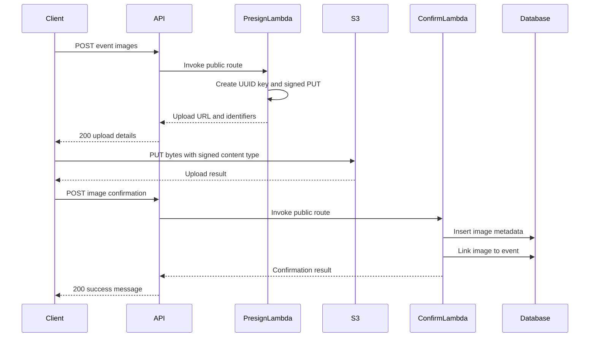

# Image uploads

The development and production HTTP APIs issue short-lived S3 URLs so clients transfer image bytes directly to the private image bucket. Lambda does not proxy file content. Both APIs use the same bucket and object-key namespace; only confirmed event-gallery metadata is separated between the `STAGING` and `PRODUCTION` databases.

The active route registrations are in [`club_image_routes.go`](../../gateway/routes/club_image_routes.go) and [`event_image_routes.go`](../../gateway/routes/event_image_routes.go). None of these routes attaches an API Gateway authorizer.

## Event-gallery flow



Presigning occurs locally with AWS credentials; the presign Lambdas do not send an object request to S3. A one-minute expiry limits when a signed request can start. It does not delete an object after upload and does not limit the lifetime of metadata saved in MySQL.

## Active endpoints

These business endpoints are registered on both `ClubEventApiDev` and `ClubEventApiProd`:

| Method and path | Handler behavior | Database access |
| --- | --- | --- |
| `POST /clubs/{clubId}/thumbnails` | Create a one-minute signed PUT URL under the club thumbnail prefix. | None. |
| `POST /clubs/{clubId}/events/{eventId}/images` | Create a one-minute signed PUT URL for an event-gallery image. | None. |
| `POST /clubs/{clubId}/events/{eventId}/images/confirm` | Record client-supplied image metadata, then link the image to the event. | Two inserts. |
| `GET /clubs/{clubId}/events/{eventId}/images` | Load event image metadata and create one-minute signed GET URLs. The referenced SELECT file is absent in the current tree, so the active handler currently takes its 500 error path. | Intended read; no SQL runs while the query file is missing. |
| `POST /clubs/{clubId}/events/{eventId}/thumbnails` | Create a one-minute signed PUT URL under the event thumbnail prefix. | None. |

`event_image_routes.go` also registers `OPTIONS` on the three event POST paths and maps it to the same Lambda integration as `POST`. The handlers do not branch on the HTTP method; if an OPTIONS request reaches a handler, it is parsed as the corresponding upload or confirmation request. Both HTTP APIs additionally have API-wide CORS preflight configuration. The club thumbnail route registers only `POST` and relies on that API-wide CORS configuration for preflight.

The commented `GET /clubs/{clubId}/thumbnails` route is not active. A GET-event-thumbnail integration function also exists in source but is not registered by either API.

## Request and response contracts

### Club thumbnail presign

`POST /clubs/{clubId}/thumbnails`

Request body:

```json
{
  "filename": "club-logo.png",
  "mimetype": "image/png"
}
```

On success, the handler creates a UUID, keeps only the extension returned by `filepath.Ext(filename)`, and signs this key for PUT:

```text
clubs/{clubId}/thumbnails/{uuid}{extension}
```

Response: `200`

```json
{
  "uploadUrl": "<one-minute S3 PutObject URL>",
  "key": "clubs/{clubId}/thumbnails/{uuid}.png"
}
```

This endpoint does not return the generated UUID separately, insert an `images` row, or update `clubs.fk_logo_id`. There is no active club-thumbnail confirmation endpoint.

### Event-gallery presign

`POST /clubs/{clubId}/events/{eventId}/images`

Request body:

```json
{
  "filename": "group-photo.jpg",
  "mimetype": "image/jpeg"
}
```

Signed object key:

```text
events/{eventId}/images/{uuid}{extension}
```

Response: `200`

```json
{
  "uploadUrl": "<one-minute S3 PutObject URL>",
  "imageId": "<uuid>",
  "objectKey": "events/{eventId}/images/{uuid}.jpg"
}
```

The Lambda does not write to MySQL. The client supplies the returned `imageId` and `objectKey` to the confirmation endpoint after its S3 PUT.

### Event-gallery confirmation

`POST /clubs/{clubId}/events/{eventId}/images/confirm`

Request body:

```json
{
  "imageId": "<uuid returned by the presign endpoint>",
  "objectKey": "events/{eventId}/images/{uuid}.jpg",
  "filename": "group-photo.jpg",
  "mimetype": "image/jpeg"
}
```

The handler first executes the equivalent of:

```sql
INSERT INTO images
    (id, purpose, object_key, filename, mimetype, created_at)
VALUES
    (?, 'event-image', ?, ?, ?, NOW());
```

It then separately executes:

```sql
INSERT INTO event_images (fk_event_id, fk_image_id)
VALUES (?, ?);
```

The first placeholder of the second insert receives the `{eventId}` path string; MySQL converts it for the `INT` foreign-key column when valid. `{clubId}` is not read. The two inserts are not wrapped in a transaction.

Response: `200`

```json
{
  "message": "Image confirmed successfully"
}
```

### Event-gallery read

`GET /clubs/{clubId}/events/{eventId}/images`

The handler has no request body. Its declared `200` success shape is:

```json
{
  "images": [
    {
      "imageId": "<image id>",
      "mimetype": "image/jpeg",
      "sourceUrl": "<one-minute S3 GetObject URL>"
    }
  ]
}
```

An event with no rows would produce `{"images":[]}`. In the current repository, however, the handler asks the embedded query client for `images/SELECT_event_images.sql`, and that file does not exist under `utils/query_client/queries/images`. Query loading therefore fails before a database request, and the deployed code returns `500` through the retrieval-error response path instead of producing the declared success shape.

The handler uses `{eventId}` but ignores `{clubId}`. It signs the `object_key` stored in each selected `images` row and returns the database MIME value as `mimetype`.

### Event thumbnail presign

`POST /clubs/{clubId}/events/{eventId}/thumbnails`

Request body:

```json
{
  "filename": "event-banner.webp",
  "mimetype": "image/webp"
}
```

Signed object key:

```text
events/{eventId}/thumbnails/{uuid}{extension}
```

Response: `200`

```json
{
  "uploadUrl": "<one-minute S3 PutObject URL>",
  "imageId": "<uuid>",
  "objectKey": "events/{eventId}/thumbnails/{uuid}.webp"
}
```

The handler uses `{eventId}` and ignores `{clubId}`. It does not insert image metadata or update `events.fk_thumbnail_id`. No active event-thumbnail confirmation endpoint performs those writes.

## Error responses

The three presign POST handlers have the same input check: JSON must decode and both `filename` and `mimetype` must be non-empty. A failure returns `400` with this literal body, which is not a JSON object:

```text
message: "Missing filename or mimetype"
```

A signing failure returns `500` with valid JSON:

```json
{
  "message": "Could not generate presigned URL: <error>"
}
```

Confirmation requires all four body fields to be non-empty. Missing or malformed input returns `400` with this literal non-object body:

```text
message: "Missing imageId, objectKey, filename, or mimetype in request body"
```

Either database insert can return `500` with a body constructed in this form:

```text
message: "Database error: <error>"
```

The event-gallery GET returns `500` with valid JSON on retrieval or signing errors:

```json
{
  "message": "Could not retrieve images: <error>"
}
```

or:

```json
{
  "message": "Could not generate presigned URL: <error>"
}
```

The presign and gallery GET Lambda handlers add these exact headers on `200` responses:

```text
Access-Control-Allow-Origin: *
Access-Control-Allow-Methods: OPTIONS,POST,GET
Access-Control-Allow-Headers: *
```

Their explicit error responses do not add those headers. The confirmation handler does not set response headers on either success or error. API Gateway also has API-wide CORS configuration and can supply its gateway-level preflight and response headers.

## S3 storage and permissions

[`ImageStack`](../../internal/stack/images.go) creates the fixed-name bucket `hunter-event-sys-uploaded-images` with:

- all public access blocked;
- SSL enforcement;
- bucket CORS allowing `GET`, `PUT`, and `POST` from `*` with all headers; and
- the CDK bucket default removal policy, which retains the bucket when its stack is deleted.

The API integrations grant only the object actions used to sign each request:

| Lambda | IAM object scope | Access |
| --- | --- | --- |
| Club thumbnail presign | `clubs/*/thumbnails/*` | Put |
| Event-gallery presign | `events/*` | Put |
| Event thumbnail presign | `events/*/thumbnails/*` | Put |
| Event-gallery GET | `events/*` | Read |

Development and production presign Lambdas use the same bucket. Keys include a club or event ID but no API environment, database name, or caller identity.

## Authentication, validation, and lifecycle behavior

- No active image route attaches the development or production Cognito authorizer. The handlers do not inspect JWT claims or call the club/event authorization Lambdas.
- The event handlers ignore the `{clubId}` path value. Presign handlers do not check that the club or event exists or that the two path IDs are related.
- Presign validation checks only JSON decoding and non-empty strings. It does not restrict path-ID format, MIME type, extension, file size, image dimensions, or file content; a filename without an extension is accepted. The supplied MIME type becomes the signed `Content-Type`, so the S3 PUT must use that signed value.
- The UUID forms the stored filename and `filepath.Ext` supplies only the suffix. The original filename is not present in the S3 key.
- Confirmation trusts `imageId`, `objectKey`, `filename`, and `mimetype` from the client. It has no S3 client or S3 permission, does not perform `HeadObject`, and does not verify that the object key matches the event ID or image ID.
- The first confirmation insert commits before the second begins. If the event-image association fails, the `images` row remains. The event foreign key can reject a nonexistent numeric event ID, but only after the image row has been inserted.
- The confirmation and GET packages create a global query client during Lambda initialization and close that connection at the end of each request. A reused warm execution environment retains the now-closed client for later invocations.
- There are no active image delete routes, S3 lifecycle rules, object cleanup calls, or rollback cleanup. Uploaded objects remain even when the client never confirms them; database rows and objects can also remain when later workflow steps fail.
- `images.object_key` is nullable and not unique in the DDL. Database constraints do not prove that metadata identifies one existing S3 object.
