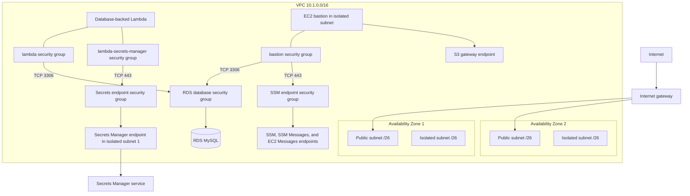

# Infrastructure reference

This document describes resources instantiated by the 11 active stack constructors and the route/integration helpers they call. Commented-out constructs—including the stub API, RDS Proxy, database test route, and read-thumbnail integrations—are not part of the deployed architecture.

## Network

`NetworkStack` creates a `10.1.0.0/16` VPC across at most two Availability Zones. Each selected AZ receives one `/26` public subnet and one `/26` private isolated subnet. The VPC has an internet gateway for the public route tables and **zero NAT gateways**.

### Security-group paths

All explicitly created security groups set `AllowAllOutbound` to false.

| Source | Destination | Port | Declared by |
| --- | --- | --- | --- |
| `lambda-secrets-manager` SG | Secrets Manager endpoint SG | TCP 443 egress | `NetworkStack` |
| Secrets Manager endpoint SG | `lambda-secrets-manager` SG | TCP 443 ingress | `NetworkStack` |
| `lambda` SG | RDS database SG | TCP 3306 egress | `DatabaseStack` |
| RDS database SG | `lambda` SG | TCP 3306 ingress | `DatabaseStack` |
| Bastion SG | RDS database SG | TCP 3306 egress/ingress | `BastionStack` |
| Bastion SG | SSM endpoint SG | TCP 443 egress/ingress | `BastionStack` |
| Bastion SG | `0.0.0.0/0` | TCP 443 egress | `BastionStack`; the isolated subnet still has no NAT route |

Database-backed API Lambdas and user-upsert Lambdas attach both shared Lambda security groups. The initializer container Lambda does the same. S3-only presigning Lambdas are placed in the VPC without supplied groups, so CDK creates one automatic security group for each of the three handler constructs in each API stack.

### VPC endpoints

| Endpoint | Type and placement | Purpose |
| --- | --- | --- |
| Secrets Manager | Interface endpoint with private DNS, one ENI in the first isolated subnet | Lets VPC Lambdas load the generated database secret without NAT |
| Systems Manager | Interface endpoint in isolated subnets | Bastion control channel |
| SSM Messages | Interface endpoint in isolated subnets | Session Manager data channel |
| EC2 Messages | Interface endpoint in isolated subnets | Systems Manager agent messaging |
| S3 | Gateway endpoint on the shared VPC route tables selected by CDK | Private S3 service route; owned by `BastionStack` |

The SSM and S3 endpoints exist only when `BastionStack` is deployed. Because they are attached to the shared VPC, their endpoint resources affect that VPC rather than only the EC2 instance.

## Data layer

`DatabaseStack` creates one RDS MySQL 8.0.37 instance:

| Setting | Current value |
| --- | --- |
| Instance class | `db.t3.micro` |
| Subnets | Private isolated |
| Multi-AZ | Disabled |
| Initial/max storage | 20 GiB / 100 GiB |
| Backup retention | 1 day |
| Credentials | Generated for username `dbadmin` and stored in Secrets Manager |
| Deletion protection | Disabled |
| Removal policy | `DESTROY` |
| Proxy | None; the RDS Proxy construct is commented out |

CDK generates the Secrets Manager secret and secret attachment. Application code receives only its ARN, the RDS endpoint, and the logical database name through Lambda environment variables; the secret value is fetched at runtime.

`DatabaseInitStack` builds `lambda/internal/database/init` as an x86-64 Lambda container image with 256 MiB memory and a one-minute timeout. Its CloudFormation custom resource performs these data changes:

1. create `STAGING` and `PRODUCTION` if absent;
2. apply `11_04_2025_create_core_tables_up.sql` to each database; and
3. apply `09_14_2025_seed_tables.sql` only to `STAGING`.

The initializer's `DatabaseInitializerLogs` log group retains logs for one week. The provider framework adds a second support Lambda and its IAM role. The schema statements use `CREATE TABLE IF NOT EXISTS`, but foreign-key `ALTER TABLE` statements and seed inserts are not fully repeat-safe.

## Authentication and authorization

`AuthenticationStack` owns the identity resources:

- a self-sign-up Cognito user pool using email as the sign-in alias;
- required, mutable email; email-only account recovery;
- a seven-character minimum password with no required uppercase, lowercase, digit, or symbol classes;
- a Cognito hosted domain with the fixed prefix `event-manager-authz`;
- a Google identity provider with `openid`, `email`, and `profile` scopes and email/name/profile-picture mappings;
- a public browser client with no client secret, authorization-code flow, Cognito and Google providers, token revocation, one-hour ID/access tokens, and a 30-day refresh token; and
- configured callback and logout URL lists.

`AuthorizationStack` creates `PostConfirmUserUpsert`, grants Cognito permission to invoke it, and uses an AWS custom resource with scoped `cognito-idp:UpdateUserPool` permission to set both the user pool's `PostConfirmation` and `PostAuthentication` triggers. It also constructs the user-pool JWT authorizer object passed into the production API.

`DevApiStack` independently creates `PostConfirmUserUpsertDev` and another `UpdateUserPool` custom resource. Both custom resources write the same two single-valued Cognito trigger slots. The database selected by the trigger is covered under [current constraints](#current-constraints-and-risks).

API Gateway creates a concrete JWT authorizer in each API stack. Both reference the shared user pool and web client.

## HTTP APIs and Lambda

`ProdApiStack` and `DevApiStack` create the `ClubEventApiProd` and `ClubEventApiDev` default-stage API Gateway HTTP APIs. Each has 18 Lambda integrations and 21 route-method resources. The three extra route-method resources are explicit `OPTIONS` routes on the event image/thumbnail endpoints and share their corresponding integrations.

Production CORS advertises `GET`, `POST`, `OPTIONS`, `PATCH`, and `DELETE`. Development advertises `GET`, `POST`, `OPTIONS`, and `PATCH`. Both allow all request headers and all origins. There are no implemented `PATCH` routes.

### Route matrix

The same application routes exist in both APIs. “JWT” reflects whether the route actually declares the Cognito authorizer.

| Methods | Path | JWT | Lambda access |
| --- | --- | --- | --- |
| `GET` | `/health` | No | None |
| `GET` | `/clubs` | No | RDS/secret; optional `verified` query behavior in handler |
| `POST` | `/clubs` | Yes | RDS/secret |
| `GET` | `/clubs/{clubId}` | No | RDS/secret |
| `GET` | `/clubs/{clubId}/events` | No | RDS/secret |
| `POST` | `/clubs/{clubId}/events` | Yes | RDS/secret |
| `POST` | `/clubs/{clubId}/members/me` | Yes | RDS/secret |
| `DELETE` | `/clubs/{clubId}/members/me` | **No** | RDS/secret |
| `POST` | `/clubs/{clubId}/thumbnails` | No | S3 put on `clubs/*/thumbnails/*` |
| `GET` | `/clubs/{clubId}/events/{eventId}/images` | No | RDS/secret and S3 read on `events/*` |
| `POST`, `OPTIONS` | `/clubs/{clubId}/events/{eventId}/images` | No | S3 put on `events/*` |
| `POST`, `OPTIONS` | `/clubs/{clubId}/events/{eventId}/images/confirm` | No | RDS/secret |
| `POST`, `OPTIONS` | `/clubs/{clubId}/events/{eventId}/thumbnails` | No | S3 put on `events/*/thumbnails/*` |
| `GET` | `/events` | No | RDS/secret; date/pagination query behavior in handler |
| `GET` | `/events/{eventId}` | No | RDS/secret |
| `GET` | `/me` | Yes | RDS/secret |
| `GET` | `/me/clubs` | Yes | RDS/secret |
| `GET` | `/me/events` | Yes | RDS/secret |

`gateway/routes` is the route source of truth. `gateway/integrations` creates a separate Go Lambda function for each integration, injects `DB_SECRET_ARN`, `DB_HOST`, `DB_NAME`, and/or `S3_BUCKET`, and binds it with `HttpLambdaIntegration`.

### Lambda packaging and runtime permissions

API and authentication handlers use the experimental CDK `GoFunction` construct pinned at `v2.208.0-alpha.0`. It cross-compiles a `bootstrap` executable for Lambda. Database-backed functions have one-minute timeouts; the health and S3-only presigning functions use construct defaults unless explicitly configured.

The helper grants produce these service permissions:

- `DbInstance.GrantConnect` and secret read permission for database-backed functions;
- bucket read or put permissions narrowed to the object patterns shown in the route table;
- API Gateway permission to invoke every integration Lambda;
- Cognito permission to invoke each user-upsert Lambda; and
- VPC network-interface and CloudWatch Logs permissions through the Lambda execution roles generated by CDK.

No shared Lambda layer is defined. SQL files under `utils/query_client/queries` are embedded into Go binaries at build time.

## Object storage and frontend delivery

### Image bucket

`ImageStack` creates the fixed-name `hunter-event-sys-uploaded-images` S3 bucket, blocks all public access, and enforces SSL. CORS accepts `GET`, `PUT`, and `POST` from any origin with any headers. The stack does not set a removal policy, so the CDK bucket default applies. It exports the bucket name and ARN implicitly when the two API stacks consume it.

### GWC frontend

`FrontendStack` creates:

- the fixed-name private `gwc-club-site` S3 bucket with `DESTROY` and automatic object deletion;
- one CloudFront origin access identity with read access;
- a distribution rooted at `/main`;
- a distribution rooted at `/production`; and
- outputs for the bucket and both distribution URL/ID pairs.

### HCC frontend

`FrontendHccStack` uses the same private-origin and SPA pattern with the fixed-name `hunter-college-club-event-site` bucket and `/staging` and `/production` prefixes. It also creates the `hcc-website-ci-deployer` IAM user and attached policy for CI deployment. That policy can list the website bucket, put/delete its objects, and create invalidations only on the two HCC distributions. CDK does not create or output an access key for the user.

Both frontend origins use the current `S3Origin`/origin-access-identity implementation. CloudFront redirects HTTP viewers to HTTPS. No custom aliases or certificates are configured.

## Administrative access

`BastionStack` creates a `t3.micro` Amazon Linux 2 EC2 instance named `monolith` in an isolated subnet. Its role attaches the AWS-managed `AmazonSSMManagedInstanceCore` policy. There is no key pair or inbound SSH rule in the stack. The `InstanceId` output is the Session Manager target.

The bastion does not receive permission to read the database secret. An operator needs a separately authorized method to retrieve credentials, and the session uses the database's private endpoint on port `3306`.

## IAM summary

| Principal | Effective purpose |
| --- | --- |
| API Lambda roles | Write logs, manage VPC ENIs when VPC-attached, read the DB secret/connect to RDS as applicable, and access narrow S3 prefixes as applicable |
| User-upsert Lambda roles | Write logs, manage VPC ENIs, read DB secret, and connect to RDS |
| Database initializer role | Write logs, manage VPC ENIs, read DB secret, and connect to RDS |
| Cognito trigger custom-resource roles | `cognito-idp:UpdateUserPool` on the shared user pool |
| Custom-resource provider roles | Invoke/operate the corresponding provider handlers; generated by CDK |
| Bastion instance role | AWS-managed SSM core permissions |
| HCC CI IAM user | Scoped website object writes/deletes, bucket listing, and two CloudFront invalidation resources |
| CloudFront OAI principals | Read only from their corresponding private frontend bucket |

## Observability and outputs

Lambda execution roles can write their standard `/aws/lambda/...` log groups. Only the database initializer supplies an explicit log group and retention period. API Gateway access logs, X-Ray tracing, CloudWatch alarms, dashboards, and WAF associations are not declared.

Each HTTP API outputs `myHttpApiEndpoint`; frontend, identity, and bastion stacks expose additional operator-facing values. The complete output list is in [stacks.md](stacks.md#operator-facing-cloudformation-outputs).

## Current constraints and risks

These behaviors follow directly from the present definitions and matter during development and operations:

1. **Two API functions have cross-stack name collisions.** Both `ProdApiStack` and `DevApiStack` explicitly create `PostJoinClubMemberMe` and `DeleteClubMemberMe` with no environment suffix. Lambda function names are unique within an account/Region, so the second API stack deployment attempts to create names already owned by the first stack.
2. **Two stacks replace the same Cognito triggers.** `AuthorizationStack` and `DevApiStack` each call `UpdateUserPool` with their own post-confirmation/post-authentication Lambda. Whichever custom resource runs last controls both triggers; Cognito cannot retain both values in those slots.
3. **`PRODUCTION_STATUS` has a fail-to-staging default.** Only `true` configures the `AuthorizationStack` upsert Lambda for `PRODUCTION`. Missing, blank, or any other value configures `STAGING`. The development upsert is always `STAGING`.
4. **Some mutating routes are public.** The delete-membership route and all image/thumbnail write or confirm routes lack a JWT authorizer. This is distinct from handler-level checks and should be treated as the actual API Gateway boundary.
5. **CORS is open and differs by API.** Both APIs allow any origin/header. Development omits `DELETE` from CORS even though it defines a delete route, so browser preflight for that route does not match the API's advertised methods.
6. **The network has no general egress from isolated subnets.** Only the declared interface/gateway endpoints and VPC-local destinations are available. The Secrets Manager endpoint is present in one AZ; the SSM and S3 endpoints depend on `BastionStack`.
7. **Several physical names are fixed.** Three S3 bucket names, the Cognito domain prefix, the CI IAM username, and many Lambda function names are explicit. S3 names are globally unique, and the other names constrain parallel deployments in the same scope.
8. **Deletion can remove durable data.** The user pool, RDS instance, and both frontend buckets use destructive removal behavior; the frontend buckets also auto-delete objects. RDS deletion protection is disabled.
9. **Database initialization changes live state and is not fully idempotent.** Recreating the custom resource or repeatedly invoking the image can encounter duplicate foreign keys or seed rows after partial or successful runs.
10. **The shared RDS instance is a single failure/capacity boundary.** Development and production use different schemas but the same single-AZ instance, endpoint, secret, security groups, storage, and backup policy.
11. **Automated coverage is minimal.** The root CDK assertion example is fully commented out, and current packages report no test files. `go test ./...` primarily verifies compilation.
12. **Synthesis emits CDK library notices.** Current notices identify the CloudFront `S3Origin`, Cognito `clientSecret`, and bastion machine-image helper APIs. Inspect the final synthesis status separately from those notices.
13. **No custom-domain resources exist.** Route 53 records and ACM certificates are outside this CDK application; clients use generated CloudFront, API Gateway, and Cognito hostnames.

Review these constraints together with the [deployment ordering](deployment.md#ordered-deployment) before changing a live environment.
