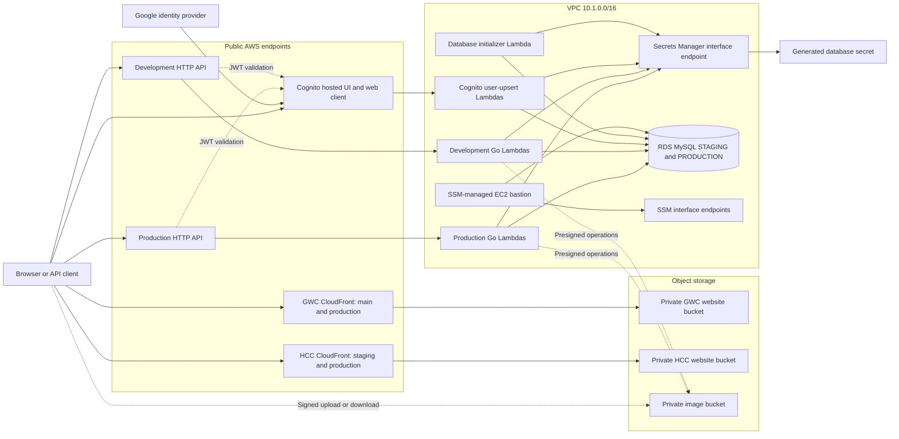

# Serverless architecture overview

## Scope

The CDK application deploys the current club event system into one AWS account and Region. Its request path is serverless—API Gateway invokes Lambda functions—but the complete system also includes an RDS database and an EC2 bastion host. Eleven stacks are active in `cdk-infrastructure.go`; frontend, identity, storage, network, data, API, initialization, and administrative resources are all part of the same CDK application.

Production and development share the VPC, RDS instance, database secret, Cognito user pool, and image bucket. Separation occurs through:

- two API Gateway HTTP APIs (`ClubEventApiProd` and `ClubEventApiDev`);
- Lambda function names that generally carry `Prod` or `Dev` suffixes; and
- two logical MySQL databases on the same instance: `PRODUCTION` and `STAGING`.

The two frontend stacks are independent of the API/data dependency graph. Each hosts static assets under branch/environment prefixes and serves them through CloudFront.

## System view

The following diagram is derived from the active stack constructors, route integrations, and Lambda resource grants.

## Active stack boundaries

| Domain | Active stacks | Responsibility |
| --- | --- | --- |
| Frontend delivery | `FrontendStack`, `FrontendHccStack` | Private S3 origins, CloudFront distributions, SPA error handling, and HCC deployment IAM identity |
| Shared network | `NetworkStack` | Two-AZ VPC, public and isolated subnets, Secrets Manager endpoint, and security groups |
| Data | `DatabaseStack`, `DatabaseInitStack` | RDS MySQL, generated secret, Lambda/database security groups, schema creation, and staging seed data |
| Image storage | `ImageStack` | Private, SSL-only S3 bucket and browser-facing CORS configuration |
| Identity | `AuthenticationStack`, `AuthorizationStack` | Cognito user pool, Google federation, web client, JWT authorizer definition, and user-to-database upsert trigger |
| APIs | `ProdApiStack`, `DevApiStack` | HTTP APIs, routes, Go Lambda integrations, resource permissions, and API endpoints |
| Administration | `BastionStack` | Isolated EC2 instance, SSM connectivity, S3 gateway endpoint, and MySQL security-group path |

See [stacks.md](stacks.md) for the exact dependency graph and every stack output.

## Request and data flows

### Static frontend

1. A browser connects to a generated CloudFront domain over HTTPS.
2. CloudFront reads from a private S3 bucket through an origin access identity.
3. The GWC distributions use `/main` and `/production` origin prefixes. The HCC distributions use `/staging` and `/production`.
4. Both frontend stacks translate S3-origin `403` and `404` responses into `/index.html` with status `200`, enabling client-side SPA routes.

The repository creates delivery infrastructure but does not build or upload either frontend application.

### Authentication

1. The browser uses the Cognito hosted domain and public web client.
2. A user can use Cognito email/password authentication or federate through Google with `openid`, `email`, and `profile` scopes.
3. The authorization-code flow redirects only to the configured callback URLs; logout redirects use the separately configured logout URLs.
4. API Gateway JWT authorizers validate tokens against the shared user pool and web client for routes that declare an authorizer.
5. Cognito post-confirmation and post-authentication events invoke a VPC Lambda that upserts the user into either `STAGING` or `PRODUCTION`.

The user pool supports self-sign-up and email-only recovery. Tokens are valid for one hour; refresh tokens are valid for 30 days.

### API and MySQL

1. The client calls the default `execute-api` endpoint of either HTTP API.
2. API Gateway invokes one Go Lambda integration for the selected operation.
3. Database-backed Lambdas run in the shared VPC with the database and Secrets Manager security groups.
4. A Lambda reads database credentials from the generated Secrets Manager secret through the private interface endpoint.
5. The Lambda connects to the RDS endpoint over MySQL port `3306` and selects the environment-specific logical database.

The production API always passes `DB_NAME=PRODUCTION`; the development API always passes `DB_NAME=STAGING`. The APIs connect directly to RDS—no RDS Proxy is active.

### Images

The image bucket is private and blocks public access. Image and thumbnail handlers return presigned operations, and their Lambda roles receive scoped S3 permissions for the corresponding object prefixes. The browser then transfers the object directly to or from S3 using the presigned URL. Database-backed image handlers store or read object metadata through RDS.

### Database initialization and administration

`DatabaseInitStack` packages the initializer as an x86-64 Lambda container image. A CloudFormation custom-resource provider invokes it to create the `STAGING` and `PRODUCTION` databases, create core tables in each, and seed `STAGING`. Its explicit log group retains logs for one week.

`BastionStack` creates a `t3.micro` Amazon Linux 2 instance in an isolated subnet. It has no inbound SSH rule; Systems Manager reaches it through the VPC's SSM, SSM Messages, and EC2 Messages endpoints. Its security group can connect only to the database security group on port `3306` plus the defined HTTPS paths.

## DNS and TLS boundary

The application does not define Route 53 hosted zones or records, custom domains, or ACM certificates. It uses provider-managed endpoints:

- CloudFront distribution domains and their default managed certificates;
- API Gateway `execute-api` domains;
- the Cognito hosted-domain prefix; and
- the private RDS and VPC endpoint DNS names.

Application Lambdas use the MySQL client's TLS setting when connecting through `NewClientFromHost`. The database initializer currently connects within the VPC without enabling its optional MySQL TLS setting.

## Current operational characteristics

- The VPC spans two Availability Zones but has no NAT gateways. Workloads placed in isolated subnets rely on the declared private endpoints and VPC-local destinations.
- The Secrets Manager interface endpoint has one network interface in the first selected isolated subnet. Lambdas may be placed across both isolated subnets and reach that endpoint over VPC routing.
- RDS is a single-AZ `t3.micro` MySQL 8.0.37 instance with 20 GiB initial storage, 100 GiB maximum autoscaling storage, and one day of backup retention.
- Both API stacks synthesize 21 route-method resources backed by 18 application Lambda integrations. The development stack also owns its Cognito upsert Lambda and custom-resource helper.
- CloudFront, API Gateway, and Lambda scale as managed services; RDS and the bastion retain their configured instance capacity.
- No API Gateway access-log group, WAF, Route 53 health check, or custom CloudWatch alarm is declared in the active stacks.

Security-sensitive and deployment-sensitive constraints are catalogued in [infrastructure.md](infrastructure.md#current-constraints-and-risks) and [deployment.md](deployment.md#deployment-sensitive-constraints).
