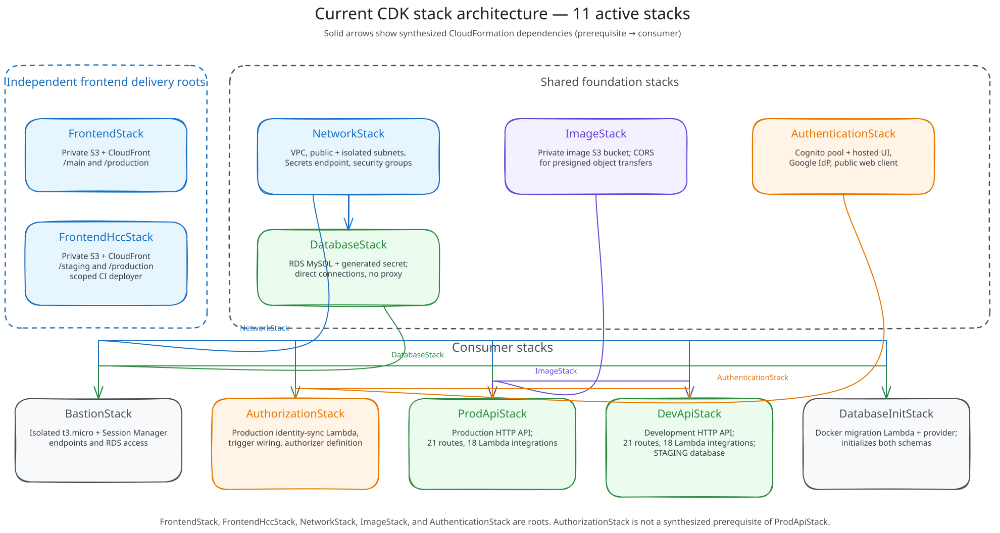
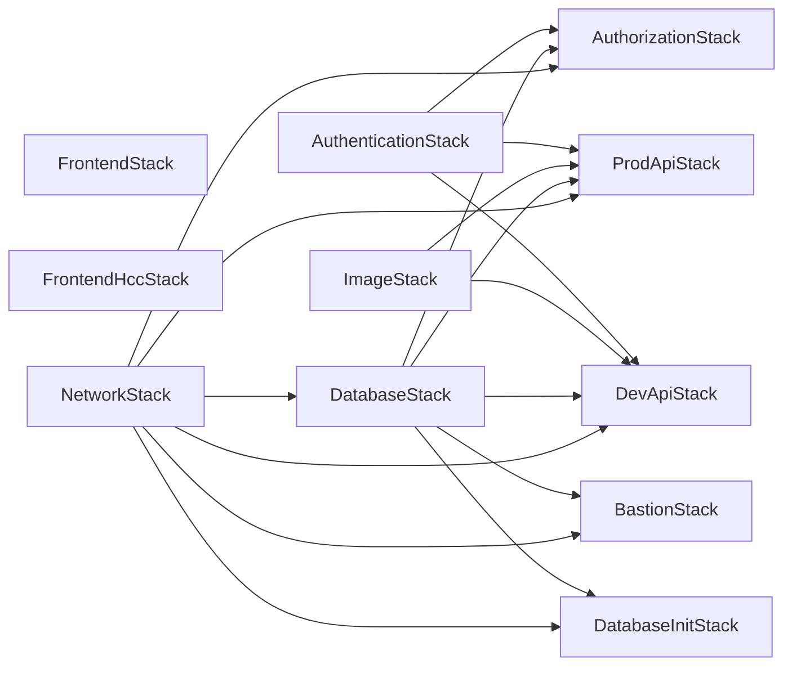

# Stack catalog and dependencies

## Stack architecture



This primary visual is a cleaned documentation derivative of the August 2025 Excalidraw. It preserves the hand-drawn stack-box layout while using the current stack names, responsibilities, and synthesized dependency directions. The [cleaned editable Excalidraw](assets/stack-architecture.excalidraw) is committed beside the SVG.

## Active stack count

`cdk-infrastructure.go` instantiates exactly these **11 active stacks**:

1. `FrontendStack`
2. `FrontendHccStack`
3. `NetworkStack`
4. `DatabaseStack`
5. `ImageStack`
6. `AuthenticationStack`
7. `AuthorizationStack`
8. `ProdApiStack`
9. `DevApiStack`
10. `BastionStack`
11. `DatabaseInitStack`

`StubLambdaStack` is source-only because its constructor call is commented out. It is not synthesized or deployed.

## Synthesized dependency reference

The Mermaid graph is a secondary, text-maintainable reference. Arrows point from a prerequisite stack to a consuming stack. The graph reflects CloudFormation stack dependencies in a synthesized cloud assembly; per-stack asset artifacts are omitted.



`FrontendStack` and `FrontendHccStack` are independent roots. `ImageStack` and `AuthenticationStack` are also roots; `NetworkStack` is the root of the data/VPC branch.

Although the entry point passes `authorization.Authorizer` to `ProdApiStack`, the authorizer object binds the concrete `AWS::ApiGatewayV2::Authorizer` inside `ProdApiStack` and references the user pool/client from `AuthenticationStack`. The synthesized production stack therefore depends directly on `AuthenticationStack`, not on `AuthorizationStack`. This also means CloudFormation does not enforce an ordering between `AuthorizationStack` and `ProdApiStack`.

## Stack catalog

| Stack | Primary resources | Values consumed | Values made available |
| --- | --- | --- | --- |
| `FrontendStack` | Fixed-name private S3 bucket; auto-delete custom resource; CloudFront OAI; `/main` and `/production` distributions | None | Website bucket and CloudFront URL/ID output strings |
| `FrontendHccStack` | Fixed-name private S3 bucket; auto-delete custom resource; CloudFront OAI; `/staging` and `/production` distributions; CI IAM user and policy | None | Website bucket, CloudFront URL/ID strings, and S3 destination strings |
| `NetworkStack` | `/16` VPC; two public and two isolated `/26` subnets; IGW/routes; restricted default SG custom resource; Secrets Manager interface endpoint; endpoint and Lambda SGs | Account/Region AZ context | VPC and `LambdaSecretsManagerSecurityGroup`; CDK exports referenced VPC/subnet/route-table/SG attributes |
| `DatabaseStack` | RDS MySQL instance and subnet group; generated secret/attachment; database and Lambda SGs | VPC from `NetworkStack` | `DbInstance`, its endpoint/secret, `DbSecurityGroup`, and `LambdaSecurityGroup` through implicit CDK exports |
| `ImageStack` | Fixed-name, public-blocked, SSL-only S3 bucket with CORS | None | Bucket object; CDK implicitly exports bucket name and ARN to both APIs |
| `AuthenticationStack` | Cognito user pool, hosted domain, Google IdP, public web client | Google credentials and callback/logout URL environment variables | User pool and app client; five explicit identity/config outputs plus implicit ARN/ID exports |
| `AuthorizationStack` | `PostConfirmUserUpsert` Go Lambda; Cognito invoke permission; `UpdateUserPool` AWS custom resource; authorizer definition object | VPC/SGs and RDS from Network/Database; pool/client from Authentication; `PRODUCTION_STATUS` | Authorizer object passed in process to production API; no explicit CloudFormation output |
| `ProdApiStack` | HTTP API/default stage; JWT authorizer; 21 routes; 18 Lambda integrations; per-function roles/permissions; three automatic SGs | VPC/SGs, RDS endpoint/secret, image bucket, and authentication IDs | `myHttpApiEndpoint` |
| `DevApiStack` | HTTP API/default stage; JWT authorizer; 21 routes; 18 route Lambdas; `PostConfirmUserUpsertDev`; `UpdateUserPool` custom resource/helper; roles/permissions; three automatic SGs | VPC/SGs, RDS endpoint/secret, image bucket, and authentication IDs | `myHttpApiEndpoint` |
| `BastionStack` | Isolated `t3.micro` EC2 instance/profile/role; bastion and endpoint SGs; three SSM interface endpoints; S3 gateway endpoint; database ingress rule | VPC and database SG | `InstanceId` |
| `DatabaseInitStack` | Docker-image initializer Lambda; one-week log group; custom-resource provider Lambda/roles; CloudFormation custom resource | VPC/SGs and RDS endpoint/secret | No explicit CloudFormation output; initializes both logical databases and seeds staging |

CDK support resources are included when required. Examples are the S3 auto-delete Lambdas, restricted-default-security-group handler, AWS custom-resource handlers, provider framework Lambda, Lambda execution roles, and API Gateway invoke permissions. They are implementation resources rather than additional application stacks.

## Cross-stack contracts

The Go structs returned by stack constructors are the in-process contract. Passing a token-backed value between stacks causes CDK to create CloudFormation exports/imports and the corresponding deployment dependency.

| Producer value | Consumers | Use |
| --- | --- | --- |
| `NetworkStack.Vpc` | Database, Authorization, Prod API, Dev API, Bastion, Database Init | Subnets, Lambda placement, endpoints, RDS, and EC2 |
| `NetworkStack.LambdaSecretsManagerSecurityGroup` | Authorization, Prod API, Dev API, Database Init | HTTPS path from Lambda to private Secrets Manager endpoint |
| `DatabaseStack.DbInstance` and generated secret | Authorization, Prod API, Dev API, Database Init | Endpoint/secret environment values and IAM grants |
| `DatabaseStack.LambdaSecurityGroup` | Authorization, Prod API, Dev API, Database Init | MySQL egress path for VPC Lambdas |
| `DatabaseStack.DbSecurityGroup` | Bastion | MySQL ingress from bastion |
| `ImageStack.Bucket` | Prod API, Dev API | S3 bucket name and scoped read/put grants |
| `AuthenticationStack.UserPool` and `AppClient` | Authorization, Prod API, Dev API | Cognito triggers and API Gateway JWT authorizers |
| `AuthorizationStack.Authorizer` | Prod API constructor | Authorizer configuration; its deploy-time tokens come from Authentication |

Do not hard-code or consume CDK's generated export names: they contain logical-ID hashes and can change with construct paths. Use stack props within the app and operator-facing outputs outside it.

## Operator-facing CloudFormation outputs

These are the stable, explicit outputs declared in source (names shown as synthesized output keys):

| Stack | Output key | Content |
| --- | --- | --- |
| `FrontendStack` | `websiteBucketName` | GWC website bucket name |
|  | `CloudFrontMainInfo` | Main distribution URL and ID in one string |
|  | `CloudFrontProductionInfo` | Production distribution URL and ID in one string |
| `FrontendHccStack` | `websiteBucketName` | HCC website bucket name |
|  | `CloudFrontStagingInfo` | Staging distribution URL and ID in one string |
|  | `CloudFrontProductionInfo` | Production distribution URL and ID in one string |
|  | `S3StagingDestination` | `s3://.../staging` destination |
|  | `S3ProductionDestination` | `s3://.../production` destination |
| `AuthenticationStack` | `UserPoolId` | Cognito user pool ID |
|  | `HostedUIDomainBaseUrl` | Cognito hosted UI base URL |
|  | `UserPoolClientId` | Browser client ID |
|  | `CallbackUrls` | Configured callback URL string |
|  | `LogoutUrls` | Configured logout URL string |
| `ProdApiStack` | `myHttpApiEndpoint` | Production HTTP API endpoint |
| `DevApiStack` | `myHttpApiEndpoint` | Development HTTP API endpoint |
| `BastionStack` | `InstanceId` | EC2 instance ID for Session Manager |

`NetworkStack`, `DatabaseStack`, and `ImageStack` also synthesize automatic outputs because other stacks reference their values. `AuthorizationStack` and `DatabaseInitStack` have no explicit outputs.

Inspect current values without putting credentials in documentation or shell history:

```bash
aws cloudformation describe-stacks \
  --stack-name ProdApiStack \
  --query 'Stacks[0].Outputs' \
  --output table
```

## Deployment layers

The dependency graph reduces to these layers:

1. independent roots: frontends, Network, Image, and Authentication;
2. Database after Network;
3. Authorization after Network/Database/Authentication;
4. both APIs after Network/Database/Image/Authentication;
5. Bastion and Database Init after Network/Database.

Application readiness adds one semantic ordering not represented by CloudFormation: initialize the database schema before sending API traffic. See [deployment.md](deployment.md) for commands and the Cognito/function-name constraints that affect an all-stack deployment.
