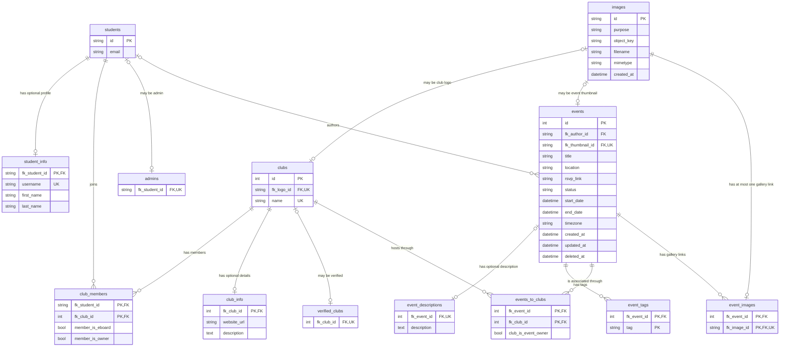

# Database schema reference

This reference is derived from the active fresh-install migration, [`11_04_2025_create_core_tables_up.sql`](../../lambda/internal/database/init/migrations/11_04_2025_create_core_tables_up.sql). The initializer applies the same 13-table DDL to `STAGING` and `PRODUCTION`. See the [database overview](README.md) for provisioning and initialization behavior.

The external [Hunter Club Event System dbdiagram](https://dbdiagram.io/d/Hunter-Club-Event-System-6861eb43f413ba35086e147c) is a supplementary project reference. Where it differs, the repository migration documented here is authoritative. The Mermaid overview uses logical type names for renderer compatibility; the tables below preserve the exact MySQL types.

## Entity relationships

The optional marker on the parent side of `verified_clubs`, `admins`, `events.fk_author_id`, `event_descriptions`, club logos, and event thumbnails reflects nullable foreign-key columns. For rows where those foreign keys are non-`NULL`, referential integrity requires the indicated parent. Association-table foreign keys that participate in a primary key are non-null.

## Constraint conventions

The migration does not write `NOT NULL` on any column. MySQL makes primary-key columns non-null implicitly; every other column remains nullable, including foreign keys, unique columns, booleans, and the event status. The stack supplies no custom database parameter group, so MySQL 8.0's default `explicit_defaults_for_timestamp=ON` also makes the undeclared-nullability `TIMESTAMP` columns nullable without automatic timestamp behavior. In the tables below, **No** in the Nullable column therefore appears only for primary-key columns.

`UNIQUE` permits multiple `NULL` values in MySQL. A nullable unique foreign key enforces one-to-one cardinality only for non-null values. No foreign key declares `ON DELETE` or `ON UPDATE`, so MySQL's default restrictive behavior applies. The migration defines no `CHECK` constraints.

## Identity and people

### `students`

The identity root. Active Cognito synchronization writes the Cognito `sub` into `id`, but the database accepts any 36-character value and does not validate UUID syntax. A student can have one profile, many club memberships, many authored events, and at most one non-null admin association.

| Column | SQL type | Nullable | Keys and behavior |
| --- | --- | --- | --- |
| `id` | `CHAR(36)` | No | Primary key. Referenced by profile, membership, admin, and event-author foreign keys. |
| `email` | `VARCHAR(255)` | Yes | No unique constraint. |

### `student_info`

An optional one-to-one profile extension for `students`. A row cannot exist without a student because its foreign key is also its primary key.

| Column | SQL type | Nullable | Keys and behavior |
| --- | --- | --- | --- |
| `fk_student_id` | `CHAR(36)` | No | Primary key and foreign key to `students.id`. |
| `username` | `VARCHAR(30)` | Yes | Unique when non-null; multiple rows can have `NULL`. |
| `first_name` | `VARCHAR(40)` | Yes | No additional constraint. |
| `last_name` | `VARCHAR(40)` | Yes | No additional constraint. |

### `admins`

Marks students with the application-wide admin role. The table has no primary key; its only column is a nullable unique foreign key. A non-null student can appear at most once, while MySQL permits multiple all-null rows.

| Column | SQL type | Nullable | Keys and behavior |
| --- | --- | --- | --- |
| `fk_student_id` | `CHAR(36)` | Yes | Unique foreign key to `students.id`; no primary key. |

## Clubs and membership

### `clubs`

The club root. Club records can have one details row, many membership rows, many event associations, an optional verification row, and an optional image used as a logo.

| Column | SQL type | Nullable | Keys and behavior |
| --- | --- | --- | --- |
| `id` | `INT` | No | Auto-increment primary key. |
| `fk_logo_id` | `CHAR(36)` | Yes | Unique foreign key to `images.id`; one non-null image can be the logo of at most one club. |
| `name` | `VARCHAR(255)` | Yes | Unique when non-null; multiple clubs can have `NULL` names. |

### `club_info`

An optional one-to-one details extension for a club. Its primary-key foreign key prevents more than one details row per club.

| Column | SQL type | Nullable | Keys and behavior |
| --- | --- | --- | --- |
| `fk_club_id` | `INT` | No | Primary key and foreign key to `clubs.id`. |
| `website_url` | `VARCHAR(255)` | Yes | No URL-format constraint. |
| `description` | `TEXT` | Yes | Explicit `DEFAULT NULL`. |

### `club_members`

The many-to-many association between students and clubs. Role is represented by two independent nullable booleans rather than an enum.

| Column | SQL type | Nullable | Keys and behavior |
| --- | --- | --- | --- |
| `fk_student_id` | `CHAR(36)` | No | Composite primary key; foreign key to `students.id`. |
| `fk_club_id` | `INT` | No | Composite primary key; foreign key to `clubs.id`. |
| `member_is_eboard` | `BOOL` | Yes | MySQL boolean value; no default. |
| `member_is_owner` | `BOOL` | Yes | MySQL boolean value; no default. |

The database prevents duplicate student-club pairs, but it does not require either role flag, enforce implications between the flags, or limit a club to one owner.

### `verified_clubs`

Marks clubs that are allowed to appear as verified. The migration attaches the table comment `Table for making sure clubs are allowed to be shown to account for bad actors creating random new clubs`.

| Column | SQL type | Nullable | Keys and behavior |
| --- | --- | --- | --- |
| `fk_club_id` | `INT` | Yes | Unique foreign key to `clubs.id`; no primary key. Multiple `NULL` rows are possible. |

## Events

### `events`

The event root. An event can be associated with multiple clubs, tags, and gallery images, and can optionally reference an author, one thumbnail, and one description.

| Column | SQL type | Nullable | Keys and behavior |
| --- | --- | --- | --- |
| `id` | `INT` | No | Auto-increment primary key. |
| `fk_author_id` | `CHAR(36)` | Yes | Foreign key to `students.id`; an author can have many events. |
| `fk_thumbnail_id` | `CHAR(36)` | Yes | Unique foreign key to `images.id`; a non-null image can be the thumbnail of at most one event. |
| `title` | `VARCHAR(255)` | Yes | No database-level required constraint. |
| `location` | `VARCHAR(255)` | Yes | No additional constraint. |
| `rsvp_link` | `VARCHAR(255)` | Yes | No URL-format constraint. |
| `status` | `ENUM('drafted', 'posted', 'archived')` | Yes | The schema's only enum; no default. |
| `start_date` | `DATETIME` | Yes | No ordering check against `end_date`. |
| `end_date` | `DATETIME` | Yes | No ordering check against `start_date`. |
| `timezone` | `VARCHAR(60)` | Yes | No time-zone identifier constraint. |
| `created_at` | `TIMESTAMP` | Yes | No default expression. |
| `updated_at` | `TIMESTAMP` | Yes | No default or automatic update expression. |
| `deleted_at` | `TIMESTAMP` | Yes | Nullable soft-deletion marker; no automatic behavior. |

### `event_descriptions`

Stores an optional long description separately from the event row. A non-null event ID can occur at most once, but the table has no primary key and permits multiple rows whose event ID is `NULL`.

| Column | SQL type | Nullable | Keys and behavior |
| --- | --- | --- | --- |
| `fk_event_id` | `INT` | Yes | Unique foreign key to `events.id`; no primary key. |
| `description` | `TEXT` | Yes | No additional constraint. |

### `event_tags`

Stores zero or more tag strings per event. The composite primary key prevents a duplicate tag string for the same event; the same tag can appear on different events.

| Column | SQL type | Nullable | Keys and behavior |
| --- | --- | --- | --- |
| `fk_event_id` | `INT` | No | Composite primary key; foreign key to `events.id`. |
| `tag` | `VARCHAR(255)` | No | Composite primary key. No normalization or vocabulary constraint. |

### `events_to_clubs`

The many-to-many association between events and participating clubs. `club_is_event_owner` distinguishes an owning club from associated clubs when the application supplies the flag.

| Column | SQL type | Nullable | Keys and behavior |
| --- | --- | --- | --- |
| `fk_event_id` | `INT` | No | Composite primary key; foreign key to `events.id`. |
| `fk_club_id` | `INT` | No | Composite primary key; foreign key to `clubs.id`. |
| `club_is_event_owner` | `BOOL` | Yes | No default. The database does not require exactly one owning club. |

## Images

### `images`

Stores metadata for objects held in S3. The table does not contain image bytes. Current event-gallery confirmation writes `purpose = 'event-image'`; the column itself accepts any string.

| Column | SQL type | Nullable | Keys and behavior |
| --- | --- | --- | --- |
| `id` | `CHAR(36)` | No | Primary key. Handlers currently generate UUID strings for presigned event uploads. |
| `purpose` | `VARCHAR(100)` | Yes | Not an enum. |
| `object_key` | `VARCHAR(255)` | Yes | S3 key; not unique and not constrained to a prefix. |
| `filename` | `VARCHAR(255)` | Yes | Client-supplied metadata. |
| `mimetype` | `VARCHAR(255)` | Yes | Client-supplied metadata; no MIME allowlist. |
| `created_at` | `TIMESTAMP` | Yes | No default in DDL; the active insert query supplies `NOW()`. |

An image ID can simultaneously be referenced by a club logo, an event thumbnail, and an event-gallery link because uniqueness is enforced separately in each referencing table, not across those uses.

### `event_images`

Associates event-gallery images with events. Its composite primary key prevents duplicate event-image pairs. The additional unique constraint on `fk_image_id` means one image can be linked to at most one event, while one event can have many images.

| Column | SQL type | Nullable | Keys and behavior |
| --- | --- | --- | --- |
| `fk_event_id` | `INT` | No | Composite primary key; foreign key to `events.id`. |
| `fk_image_id` | `CHAR(36)` | No | Composite primary key, unique key, and foreign key to `images.id`. |

## Relationship summary

| Relationship | Database cardinality |
| --- | --- |
| Student to profile | One student to zero or one `student_info` row. |
| Student to clubs | Many-to-many through `club_members`. |
| Student to authored events | One student to many events; the event author is nullable. |
| Student to admin marker | One student to zero or one non-null `admins` row. |
| Club to details or verification | One club to zero or one non-null row in each extension table. |
| Club to events | Many-to-many through `events_to_clubs`. |
| Event to description | One event to zero or one non-null description row. |
| Event to tags | One event to many tags. |
| Event to gallery images | One event to many links; one image to at most one link. |
| Image to club logo | Optional one-to-one per non-null club logo reference. |
| Image to event thumbnail | Optional one-to-one per non-null event thumbnail reference. |

All relationships are enforced only by the declared keys. The schema contains no cascade actions, ownership-count rules, or cross-table constraint that reserves an image for exactly one purpose.
