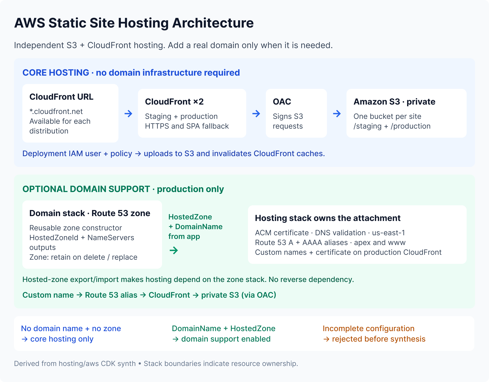

# AWS website hosting

Independent AWS CDK stacks host the Girls Who Code at Hunter and Hunter College Clubs / Event Manager static websites using private S3 buckets and CloudFront. Custom domains are optional; the existing Girls Who Code production domain is already live.



[Edit the architecture diagram in Figma](https://www.figma.com/design/i19JIkiEiAfqoTPNBUUcKe/GWC-Club-Website--Copy-?node-id=4168-2). The `AWS Static Site Hosting Architecture` frame (`4168:2`) is on the `AWS Hosting Architecture` page. The repository image is a 2× PNG export (2800 × 2192); re-export that frame after architecture changes so the README stays self-contained.

## Overview and source of truth

This is the authoritative hosting guide. The implementation remains in [`aws/`](aws/), a self-contained Go module with its own `go.mod`, `cdk.json`, entry point, and internal packages. Keeping that boundary avoids import/module churn and separates static frontend hosting from the backend API and database. Frontend application source and asset delivery automation are maintained separately.

The diagram follows the current Go code and synthesized CloudFormation templates:

| Source | Responsibility |
| --- | --- |
| [`aws/main.go`](aws/main.go) | Actual stack IDs, current domain configuration, and stack wiring |
| [`girls_who_code.go`](aws/internal/stack/girls_who_code.go) | GWC core hosting, paired domain validation, certificate, and DNS aliases |
| [`girls_who_code_domain.go`](aws/internal/stack/girls_who_code_domain.go) | Reusable public-zone constructor, retention, and outputs |
| [`hunter_college_clubs.go`](aws/internal/stack/hunter_college_clubs.go) | Independent domainless Hunter hosting |
| [`girls_who_code_domain_test.go`](aws/internal/stack/girls_who_code_domain_test.go) | Assertions for domain-enabled, domainless, and invalid configurations |

The app currently synthesizes these three environment-agnostic stacks:

| Stack ID | Current configuration | Synthesized primary resources |
| --- | --- | --- |
| `GirlsWhoCodeDomainStack` | Live GWC authoritative DNS | 1 retained public Route 53 hosted zone |
| `FrontendStack` | Live GWC hosting, production domain attached | 1 S3 bucket, 2 CloudFront distributions, 1 OAC, deployment IAM user/policy, 1 ACM certificate, 4 Route 53 alias records |
| `FrontendHccStack` | Hunter hosting without a domain | 1 S3 bucket, 2 CloudFront distributions, 1 OAC, deployment IAM user/policy; no domain resources |

`FrontendHccStack` is the exact Hunter stack ID. Its entry describes the implemented configuration; deployment ownership must still be reviewed before deploying Hunter. Bucket policies and the bucket auto-delete custom resource with its supporting Lambda/IAM role are omitted from the diagram for readability.

The hosting module was adapted from `GWC-Hunter-College/Website-Hosting-Iac` at commit `21152e45112f0fe925b57798675650f1027828a7` and checked against the matching frontend stacks in the preserved [legacy implementation](../infrastructure/legacy/README.md).

## Core S3 + CloudFront hosting

Each site's constructor creates:

- **One private S3 bucket:** static build artifacts live under separate `/staging` and `/production` origin prefixes.
- **Two CloudFront distributions:** staging and production each serve their matching prefix, redirect viewers to HTTPS, and use `index.html` as the default root object. S3 403/404 responses become `/index.html` with HTTP 200 for SPA routing.
- **One shared origin access control (OAC):** CloudFront signs requests to S3 with SigV4. The bucket policy grants `cloudfront.amazonaws.com` read access scoped to that site's two distribution ARNs.
- **Deployment IAM user and policy:** uploads/deletes objects and lists the site's bucket, and invalidates only that site's two distributions. This identity is independent of OAC; the stacks create no access keys and output no credentials.
- **CloudFormation outputs:** bucket name, generated CloudFront URLs and distribution IDs, and staging/production S3 deployment destinations. Read the generated values from stack outputs rather than hardcoding them.

A generated `*.cloudfront.net` URL is sufficient for hosting and testing. Core hosting needs no public hosted zone, Route 53 DNS records, custom-domain certificate, or domain-stack dependency. The CDK module does not build frontend assets or deploy them with an S3 deployment construct; the uploader must populate the correct prefixes separately.

The two hosting constructors use the same pattern but remain site-specific, with fixed physical bucket and IAM names:

| Site | Constructor | Bucket | CI user / policy |
| --- | --- | --- | --- |
| Girls Who Code | `NewGirlsWhoCodeHostingStack` | `gwc-club-site` | `gwc-website-ci-deployer` / `frontend-gwc-ci-policy` |
| Hunter College Clubs | `NewHunterCollegeClubsHostingStack` | `hunter-college-club-event-site` | `hcc-website-ci-deployer` / `frontend-hcc-ci-policy` |

There is no generic all-sites hosting factory. Do not deploy a second copy of the GWC constructor for Hunter: its fixed names would collide.

## Optional custom domains and ownership

The following rule applies to `GirlsWhoCodeHostingStackProps`:

| `DomainName` | `HostedZone` | Result |
| --- | --- | --- |
| Omitted/empty | Omitted/nil | Core hosting only; nil props also work |
| Supplied | Supplied | Add production custom-domain support |
| Supplied | Omitted/nil | Panic before synthesis |
| Omitted/empty | Supplied | Panic before synthesis |

The validation error is `GirlsWhoCodeHostingStack requires DomainName and HostedZone together, or neither`.

With both props, the **hosting stack** owns the DNS-validated ACM certificate, CloudFront production aliases/viewer certificate, and four Route 53 alias records: A and AAAA for both apex and `www`. The **domain stack** owns only the public zone and outputs `HostedZoneId` and `NameServers`.

`NewGirlsWhoCodeDomainStack` accepts a caller-supplied domain name and stack ID, so another site can reuse it despite its historical Go name and internal zone construct ID. The hosting prop accepts an `IPublicHostedZone`, including an existing-zone reference. Keep the live GWC zone under its current managed construct and stack ownership.

In `main.go`, `girlsWhoCodeDomainName` supplies the plain domain string to both constructors, while `domainStack.HostedZone` supplies the zone reference to hosting. The zone ID creates an automatic CloudFormation export/import for ACM validation and DNS records: **`FrontendStack` depends on `GirlsWhoCodeDomainStack`**. There is no reverse reference or explicit dependency call; the domain string itself creates no import. Domainless GWC hosting creates no domain imports or dependencies.

Keep the certificate and alias records in `FrontendStack`. Moving them into the zone stack would change resource ownership and could introduce a circular dependency because the records target the hosting stack's production distribution.

## Girls Who Code: current live deployment

`GirlsWhoCodeDomainStack` and `FrontendStack` already serve `girlswhocodehunter.org` and `www.girlswhocodehunter.org`. Both names reach the existing production distribution and `/production` content; neither name redirects to the other. Staging retains its generated CloudFront URL.

The configuration in `main.go` intentionally supplies both domain props. **Do not remove those props or the domain-stack instance from the live app:** doing so would request removal of its working certificate, CloudFront custom aliases, and DNS records. The domainless constructor path is for configurations that do not have a domain.

Namecheap remains the registrar for registration and renewals; Route 53 is the authoritative DNS host. Generated nameservers, zone IDs, certificate ARNs, and distribution IDs are resolved through constructs and outputs, not configuration or `.env` files. Preserve ACM validation records for certificate renewal.

The existing stack was previously confirmed in `us-east-1`. `environment()` still returns `nil`, so the code does not pin account/region. Use the same deployment account and region. CloudFront custom-domain certificates must be in `us-east-1`; for a hosting stack in another region, design separate certificate integration instead of moving that hosting stack.

## Hunter College Clubs: current and future

`FrontendHccStack` currently stands alone. `HunterCollegeClubsHostingStackProps` has no domain fields, and the constructor creates no hosted zone, Route 53 records, custom-domain ACM certificate, or domain dependency. Its generated CloudFront URLs are sufficient today.

When Hunter acquires a real domain, reuse the existing zone constructor with a separate stable stack ID and add explicit domain integration to the Hunter hosting constructor. Passing domain props to the current Hunter constructor is not yet supported. No placeholder domain or future Hunter domain resources are configured.

## Adding a real domain later

Only introduce a site's domain stack once it has a real domain to configure.

1. Review the site's existing stack/resource ownership and deployment environment. Preserve its bucket, distributions, OAC, and IAM identities.
2. Instantiate the reusable zone constructor with the real domain and a separate stable stack ID, or deliberately integrate an existing zone under its established ownership. Do not create a duplicate GWC zone.
3. Add/confirm the site's hosting integration for both `DomainName` and `HostedZone`. Keep the certificate and production aliases/records in hosting and the zone in the domain stack. Hunter requires this implementation work first.
4. Synthesize and review diffs. For a newly managed zone, deploy that zone stack first and read its `NameServers` output.
5. Set the registrar's authoritative nameservers to the four generated Route 53 values and wait for delegation to propagate. At Namecheap, use **Domain List → the domain → Manage → Nameservers → Custom DNS**. This changes DNS hosting, not the registrar; do not add Namecheap A records pointing at CloudFront.
6. After delegation works, review and deploy the hosting attachment. Expect one certificate, four apex/`www` aliases, and an update to the existing production distribution's custom names and certificate. Investigate any proposed replacement of existing core resources. Deploying before delegation propagates can leave ACM validation pending.
7. Verify HTTPS for apex and `www`, staging access, and certificate validation/renewal records.

GWC has already completed this two-stage setup. Routine updates should preserve its existing zone and domain attachment; they do not require recreating the zone or repeating registrar delegation.

## Local validation and deployment commands

Start at the repository root. Install Go and the AWS CDK CLI, then run:

```sh
cd hosting/aws
go mod download
go test ./...
go vet ./...
go build ./...
cdk synth --all
```

[`aws/cdk.json`](aws/cdk.json) runs the Go app. Synthesis writes local CloudFormation templates and does not deploy anything. Tests cover domain-enabled GWC, domainless GWC with nil/stack-only props, domainless Hunter, and rejection of partial domain configuration.

The following commands run from `hosting/aws`. Before any eventual AWS review/deployment, select the existing deployment profile and confirm the account and stack. `default` below is the profile used for the earlier GWC ownership check; substitute the intended existing profile when necessary.

```sh
export AWS_PROFILE=default
export AWS_REGION=us-east-1
export AWS_DEFAULT_REGION=us-east-1
aws sts get-caller-identity
aws cloudformation describe-stacks --stack-name FrontendStack \
  --region us-east-1 --query 'Stacks[0].[StackId,StackStatus]'
cdk diff GirlsWhoCodeDomainStack FrontendStack --no-change-set
cdk diff FrontendHccStack --no-change-set
```

`--no-change-set` compares against deployed templates without creating a CloudFormation change set. For the unchanged live GWC configuration, expect no infrastructure differences. Hunter's diff must be interpreted against its independently reviewed ownership/deployment state.

For an approved change to the **existing** GWC stacks, these are the stack-specific deployment commands. They are operational reference commands, not required steps for reviewing these docs:

```sh
cdk deploy GirlsWhoCodeDomainStack
aws cloudformation describe-stacks --stack-name GirlsWhoCodeDomainStack \
  --region us-east-1 --query 'Stacks[0].Outputs' --output table
dig NS girlswhocodehunter.org +short
cdk deploy FrontendStack
curl -I https://girlswhocodehunter.org
curl -I https://www.girlswhocodehunter.org
```

Review the deployment change set as well as the template diff. If a new domain setup is being performed, complete registrar delegation between its zone and hosting deployments as described above. For an approved domainless Hunter deployment, after its ownership review, use `cdk deploy FrontendHccStack`; no domain stack is needed.

## Production safety and preserved identities

GWC is live infrastructure. The module extraction, optional-domain refactor, and this documentation do not authorize recreation or migration of its resources.

| Stack | Resource | Preserved logical ID |
| --- | --- | --- |
| `GirlsWhoCodeDomainStack` | Public zone | `GirlsWhoCodeHostedZoneDBA9EB09` |
| `FrontendStack` | S3 bucket | `GwcWebsiteBucketE6A54810` |
| `FrontendStack` | Staging distribution | `FrontendMain4FAF8302` |
| `FrontendStack` | Production distribution | `FrontendProduction57D7F36D` |
| `FrontendStack` | Certificate | `GirlsWhoCodeProductionCertificate70C3275C` |

The four alias-record IDs, zone export, environment behavior, and deployment IAM identities are also preserved. The zone has both `DeletionPolicy: Retain` and `UpdateReplacePolicy: Retain`. A retained zone needs adoption/import before its owning stack is recreated; retention does not make a second zone stack safe.

- **Buckets can be deleted:** both use `RemovalPolicy_DESTROY` with automatic object deletion. Stack removal or replacement can permanently delete hosted assets; this work adds no retention to them.
- **CI users are stack-managed resources:** both have an explicit destroy policy. Check account-level fixed-name conflicts and import an existing user into its intended stack before deployment. Switching to `User_FromUserName` would leave it externally owned. Treat deletion of a CI user as credential revocation and retire/replace its deployment credentials first.
- **Preserve GWC's adopted user:** the existing user was adopted without rotating its externally created access key or removing its historical `GWCWebsiteCICDPolicy` attachment. The CDK app does not define/expose that key. Hunter's named user did not exist at the earlier ownership check and remains a normal stack-created resource in code; verify current ownership before deployment.
- **Use one owner:** do not deploy the hosting stacks from both this module and `infrastructure/legacy`. Stable logical IDs only preserve identity when the same account, region, and CloudFormation stack remain the owner. Different ownership can cause fixed-name conflicts or duplicate/replaced distributions.
- **Preserve staging integration:** the reference GWC origin used `/main`; this module intentionally uses `/staging`. Its historical `FrontendMain` construct and `CloudFront_Main_Info` output IDs remain. Hunter uses `FrontendStaging` and `CloudFront_Staging_Info`. Coordinate uploaders and review origin paths before deployment. GWC S3 destination outputs use explicit application names; Hunter's historical IAM/output IDs remain unchanged.

The diagram and this guide were checked against `cdk synth --all`: one zone in the domain stack; two distributions and one OAC per hosting stack; one certificate and four alias records only in GWC hosting; and a one-way GWC hosted-zone dependency. Local Go tests, vet, and build passed. This documentation update performs no AWS deployment or resource changes.
