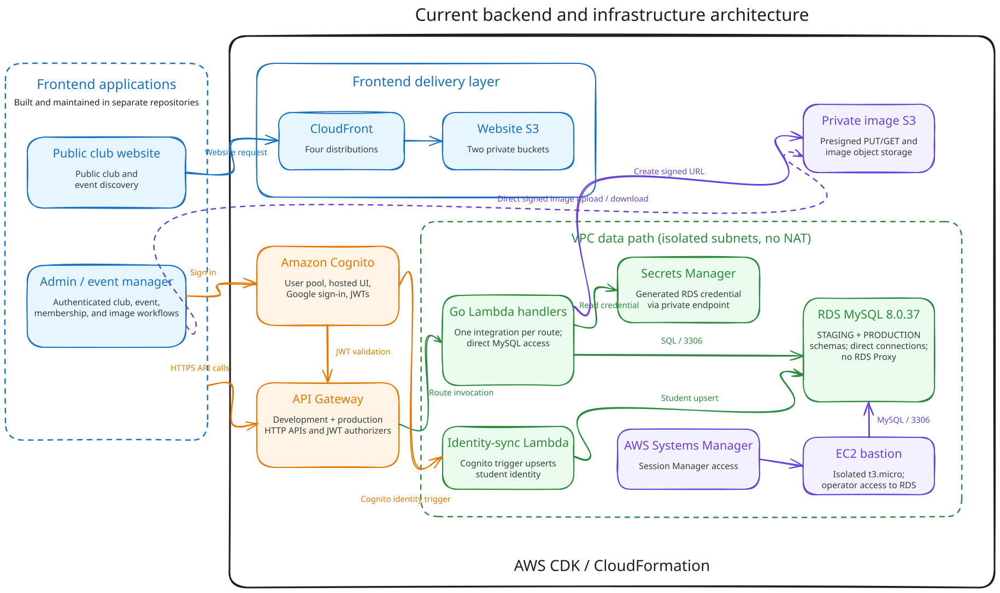
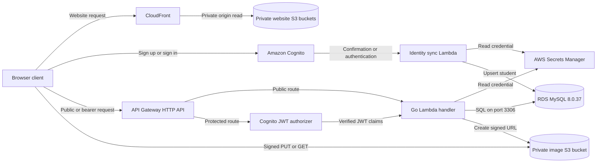

# Architecture overview

The preserved legacy implementation provides the AWS-hosted backend and delivery infrastructure for Girls Who Code at Hunter and the broader Hunter College club event-management ecosystem. It stores and serves club, event, membership, permission, and image data while supporting public discovery, authenticated management operations, Cognito sign-in, and direct-to-S3 image uploads.

The public club website and the administrative/event-management application are built in separate frontend repositories. They use the CloudFront delivery and backend services provisioned here.

The CDK application synthesizes development and production APIs together. Both use the same VPC, RDS instance, Cognito user pool, and image bucket. API data is separated into `STAGING` and `PRODUCTION` MySQL schemas; the API Gateway instances and most route Lambda names are environment-specific.

## Detailed system view

This primary diagram is a cleaned documentation derivative of the June 2025 Excalidraw. It retains the useful client, authentication, API, Lambda, MySQL, image-storage, and operator-access relationships while reflecting the current code: separate frontend repositories, development and production HTTP APIs, direct RDS connections, private Secrets Manager access, and signed client-to-S3 transfers. The [cleaned editable Excalidraw](assets/backend-architecture.excalidraw) is committed beside the SVG for future maintenance.

## Request-flow reference

The Mermaid diagram is a secondary, text-maintainable view of the main runtime paths.

API Gateway validates tokens only on routes that explicitly attach the Cognito authorizer. Protected handlers read the caller's Cognito `sub` claim and use it as `students.id`; some also read `email`. Club roles and admin records live in MySQL rather than Cognito. See [Authentication](authentication.md) and [Authorization](authorization.md) for the exact boundary and the routes that enforce it.

Database Lambdas run in isolated VPC subnets. They retrieve the generated RDS credential from Secrets Manager through a private interface endpoint and connect directly to the RDS instance. The CDK source does not create an RDS Proxy. Image clients upload directly to the private S3 bucket using short-lived signed URLs; Lambda records metadata only for confirmed event gallery images. See [Image uploads](image-uploads.md).

## Environment boundaries

| Concern | Development | Production | Shared |
| --- | --- | --- | --- |
| HTTP API | `ClubEventApiDev` | `ClubEventApiProd` | — |
| MySQL schema | `STAGING` | `PRODUCTION` | One RDS instance and one generated secret |
| Route Lambdas | Usually suffixed `Dev` | Usually suffixed `Prod` | Source packages and security groups |
| Authentication | Development authorizer bindings | Production authorizer bindings | One Cognito pool and browser client |
| Images | Same object-key patterns | Same object-key patterns | One S3 bucket; keys have no environment prefix |
| Network | — | — | One VPC and one endpoint set |

This is partial isolation rather than separate AWS environments. The Cognito trigger configuration and image object namespace are shared. The [deployment guide](../architectures/serverless/deployment.md) explains the resulting ordering and fixed-name constraints.

## Infrastructure boundaries

The CDK app creates 11 active stacks:

- two S3 and CloudFront frontend stacks;
- network, database, image-storage, authentication, and authorization foundations;
- development and production HTTP API stacks;
- an SSM-managed database bastion; and
- a custom-resource-backed database initializer.

Cross-stack resource references establish the deployment graph. See the [stack catalog](../architectures/serverless/stacks.md) and [infrastructure guide](../architectures/serverless/infrastructure.md) for resource-level detail.

## Current service inventory

| Service | Role |
| --- | --- |
| AWS CDK v2 and CloudFormation | Define and deploy the application as 11 stacks. |
| API Gateway HTTP API | Hosts corresponding development and production route sets. |
| AWS Lambda | Implements API operations, identity synchronization, and database initialization. |
| Amazon Cognito | Provides email/password and Google sign-in, a hosted UI, JWTs, and identity triggers. |
| Amazon RDS for MySQL | Stores students, clubs, memberships, events, roles, verification, and image metadata. |
| AWS Secrets Manager | Stores the generated RDS credential used by VPC Lambdas. |
| Amazon S3 | Stores two web applications and user-uploaded images. |
| Amazon CloudFront | Delivers main/staging and production prefixes from private website buckets. |
| Amazon VPC and AWS PrivateLink | Isolate RDS and Lambdas and provide private Secrets Manager and SSM access. |
| Amazon EC2 and Systems Manager | Provide an isolated, SSM-accessed database bastion. |
| IAM | Grants Lambda, Cognito, bastion, CloudFront, and frontend deployment permissions. |

The current CDK source creates no Route 53 hosted zone, DNS record, or certificate. Frontend and API URLs use AWS-assigned domains and are exposed through CloudFormation outputs.

## API and data model

Both HTTP APIs register 18 business method/path pairs. Public reads cover health, clubs, and posted events. Six operations attach the Cognito JWT authorizer. Image operations do not attach it. Start with the [API reference](../api/README.md).

Fresh database initialization creates 13 tables in each schema. The model supports club membership, multi-club event hosting, member role flags, optional club and event images, club verification, and admin records. See the [database overview](../database/README.md) and [schema reference](../database/schema.md).

## Design reference

The historical project PDF informed the service boundaries, multi-club data model, direct-to-S3 upload pattern, and cost categories. Its embedded endpoint trackers and diagrams differ materially from several active resources, routes, and tables. The maintainable diagrams in this documentation are therefore derived from the repository source.
